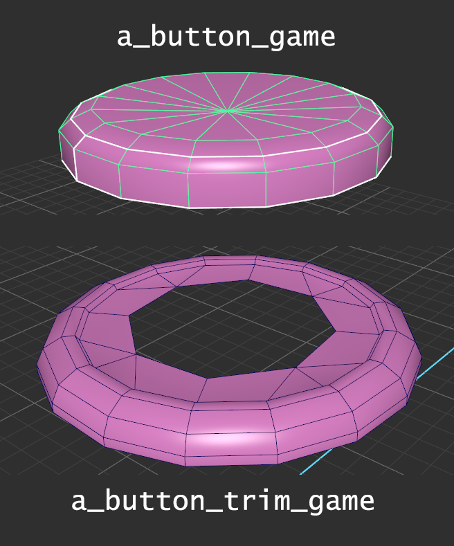

## Last week's deliverables
How far did people get with subdivs?
* Did everyone watch the vid with alex?
* Looking at images delivered
* Checking out comments
    
### Progress?
* How much fixing do we need to do? 
* When it's done we can move on and look at retopo 🎉

## How is this useful?

These meshes don't make sense for games. 

**Unsmoothed subd models** have all these weird edges purely for the smooth algorithm. No good in games, too much pointless geometry, and they can be really far from the final silhouette.


Different: the subdiv mesh's pre- and post-smoothing silhouettes


**Smoothed subd models** look good but are too high poly for game engines. They might be 200K polys where we want say 2K or less.

### Something in between

What if we had something in the middle? 
  * a totally new, hand made, mid weight mesh (say 2K)
  * It has a silhouette that looks more like the smoothed subd mesh than the unsmoothed one, but it's still faceted.
  * It could somehow steal the smoothed subd mesh's skin, then wear it like a suit (creepy) but still run fast (really useful). 
    * More on how to do this next week.
    * A bit like skinning a wolf and wearing it as a cloak. You look way hairy but you actually have a very simple, smooth surface.
  

1. A subd mesh without smoothing | 2. A game ready mesh | 3. The subd mesh again smoothed.  
_(Just an illustration: don't move meshes side by side or duplicate your smoothed subd)_


## What's a game ready mesh?
  
A game ready model is one that will look as much like our prop as possible but is light enough (in triangles and textures) that it won't slow our frame rate down too much or eat up all the memory.


Consider a cylinder with a height of 2 units and a diameter of 1 unit. It's an ideal volume, an idea of perfect roundness with perfect flatness at the top and bottom. Our model isn't that though, it's a bunch of triangles that only _approximate_ it. It could use 100, 1k or 1m triangles. 

_**The arrangement of polygons currently representing that ideal cylinder is our model's topology.**_

It's the same with the models in our game. When you play on Ultra graphics, Tracer (a character in Overwatch) might have say 20k triangles. Run on Low graphics and maybe she has 4k. The same character, just represented with different _topology._ If you squint, they even look the same.


## Making the game ready mesh
  
**Goal** Produce a mesh that:
1. Has a triangle count that fits in a given range (say 1000-2500 polygons). (defined by certain production and hardware realities)
2. Provides a silhouette closely matching that of the smoothed mesh, though more faceted.
3. Sits at the same point in space and is the same size, which will be important later.

### Download
Grab this [breakfast mug maya project](week3_breakfast.zip)

### How's it possible?
There are a few ways to do it, but they all involve making a game-resolution mesh in the same space as the smooth reference model so you can match them as close as possible.
This takes organisation and some Maya knowledge, because otherwise you're going to not be able to see or select the game mesh half the time!


When objects need to share space, how do you model?


Tools:
  1. **XRay modes!** Xray the scene or individual meshes
    * In a viewport enable `Shading -> X Ray`. I've hotkeyed to alt-x for now.
    * X Ray one object in _Modeling Toolkit's_ `Object` menu.
  2. **Freeze (template) toggle!**
      * It does what the T (template) mode for a layer does, but for an object.
      * It's in _Modeling Toolkit's_ `Object` menu.
      * I've hotkeyed it to alt-shift-f (in the hotkey editor you need to search for _template toggle_).

### Get set up
* Make a duplicated, 1-2x smoothed version of the subd mesh (maybe 30K+ polys). Give it a layer of its own. subd_heavy This is ANOTHER mesh needed.
* Hide the original subd (can be edited later if need be)
* Give the subd_heavy it's own material (red) and make it x-ray.

### Modeling the new mesh
      
**Model from scratch**: slap down a new primitive and start modeling again, around the subd, trying to match the silhouette.

_or_

**Duplicate the unsmoothed subd mesh**, call that the game mesh, then heavily** modify it**:
  * Reduce the poly count
    * Remove loops that don't affect the silhouette. Support edges mostly don't.
    * Remove edges that do support the silhouette but won't be missed too much: eg reducing a cylinder from 16 to 8 sides.
  * Move points/loops/edges around until you approximate the smoothed model but with less polys

_or_

**Duplicate and smooth the subd mesh** using `edit mesh -> smooth []` with `level=1` and then **modify/optimise** that mesh.

_or_

**mix all those approaches**!
<!--2. Trace the mesh using live mode and quad draw.
* Make subd_heavy a live mesh
* Start quad drawing on it.
* turn off live, make other changes.-->

Game meshes (blue) occupying the same space as the subd meshes (transparent red). Contrasting materials make life a lot easier.


 Table showing the four meshes and their use.

## Homework

1. Apply feedback to and finalise your subd models. Give them the suffix _sub, ie: `screenGlass` becomes `screenGlass_subd`
2. Create game ready meshes for each element using what you learned in week 3 about retopology. Suffix them with `_game`, as in `screenGlass_game`

How to name your meshes. (DO NOT move your meshes side by side, this image only demonstrates naming)


3. **Uv unwrap** all your game ready models (_not_ the subd models) and use layout to pack them all into the same UV space (see final video of week 3 class for review of uv unwrap).

[Reply to this thread on Blackboard](https://laureate-au.blackboard.com/webapps/discussionboard/do/message?action=list_messages&course_id=_89547_1&nav=discussion_board_entry&conf_id=_152757_1&forum_id=_866555_1&message_id=_2100661_1) and post:
1. Your concept image
2. Images of your finished subd meshes with smooth preview on and:
   * with wireframe onshaded on
   * then off.
3. An image of your your checkerboarded models next to finished UVS.


All mug parts selected, uv checkerboard on, image > dim on

<!--
## Overview

* Talking [week 2](../week2/#deliverable-this-week) homework
* Tips for modeling Challenges
* Learning how to go from modeling to baking and texturing
  * Looking through joystick files
  * Game res model vs subd
  * UV unwrapping for a good normal map bake
  * Substance import/bake
  * Basic material application

### Download This Project


Blue is subd, pink is game resolution.


I pushed on with the arcade style joystick controller during the week. We'll look through it this week and I'll work on the box section to demonstrate the workflow.

<a class="btn btn-lg btn-primary mr-3 mb-4" href="https://laureateaus-my.sharepoint.com/:u:/g/personal/daniel_mcgillick_laureate_edu_au/ETZ9nYhG-4dKouOgkoFIvDcBiB5P5gzcmCGe1iREAwD-hA?e=oMkiD0">Joystick Project Zip<i class="fas fa-arrow-alt-circle-right ml-2"></i></a>

## Week 2 Deliverables

Previously you submitted your choice of concept to the forum. This week, you submitted a plan and your subd and game res models.

[week 2](../week2/#deliverable-this-week)

Let's have a look at the forum.

### Modeling Challenges We Encountered

Modeling is something that'll always present challenges, and you'll be forever improving.

### Topology Help

How do we stick to quads? We constantly reach areas that would be solved with a quick triangle. 
* How do other people handle these problems?
* Can we hide triangles? Ngons? 

Tens of thousands of artists have been out there there modeling every day for decades, lean on them:
* [My Topology Pinterest board](https://www.pinterest.com.au/dmacdraws/topology/)
* [Polycount thread about high res modelling problems](https://polycount.com/discussion/56014/how-the-f-do-i-model-this-reply-for-help-with-specific-shapes-post-attempt-before-asking/p127)  
* Google, Youtube, Gumroad!
  
#### Paintovers

Modelling is slow and destructive, not great for quick iterations.

Painting:  
  1. Take greyscale screenshots
  2. Do a rough linework layer if needed
  3. Paint basic light planes with 3 or 4 tones to create your new form
  4. Refine, try multiple options
  5. Assess what needs maya modelling, what can be done with stamping/normal maps (embossed text, panels)
  5. Implement modelling changes in maya


For the first pass a draw-over might be more in your comfort zone.


## How it all works

We create two sets of meshes in Maya, then take them to painter. One set survive as the game meshes, the others (subds) are just used to generate normal maps.

### Meshes in Maya

We create **two kinds** of meshes inside Maya. 
1. The **subd** meshes (button and trim) are in **blue**. 
2. The **pink** button and trim are **two new meshes**, which will go in the game.

**Note**: The same blue button and trim (outer ring) meshes **appear twice** in the next image: normal view and smooth preview.


Smoothed and unsmoothed views of the subd meshes (button and trim) and one view of the game meshes (button and trim)


1. **Subd meshes**
   * `a_button_trim_subd` and `a_button_subd`
   * We view them in normal mode (press `1`) and smoothed mode `3`. 
   * To **control** how it looks when smoothed, we **add** loops and edges to it.
   * It has more geometry than we need in the game, even when viewed in normal view, because of the extra loops and edges.
   * We try to stick to **quads** (rectangles) that **flow** around the model.
   * When _Maya_ **exports** this mesh it **subdivides** it several times, creating a very large number polygons.
   * **DO not need UV maps**. These only exist to be **analysed and discarded** by _Substance Painter_ in the creation of normal maps, which will be applied to the game mesh.
2. **Game meshes**. 
   * `a_button_trim_game` and `a_button_game`
   * These are never smoothed
   * They have a similar silhouette to the smooth-view subd meshes
   * They have **fewer polygons** than their equivalent subd mesh (even unsmoothed). This **improves frame rate**.
   * Triangles are no problem
   * They will go in the game and use a normal map.
   * To accept the normal map **game meshes need to be UV mapped.**

{}
The button and trim are two meshes used to create a whole button unit. Each has a subd variant and a game variant.

`a_button_game` and `a_button_trim_game` meshes shown separately.
{}

### Meshes In Painter

We create a new project with the game meshes `a_button_game` and `a_button_trim_game` (the ring around the button), then bake normal maps for them by analysing and discarding the subd meshes.


Four views of the same two meshes in Painter, <code>a_button_game</code> and <code>a_button_trim_game</code>



Here are some snippets of the normal map representing the button


## UV Mapping

You only need **UV maps on your game mesh**. Your subd mesh dos not need them.

1. Create starting UVs with Camera Projection
2. Select edges to create seams, delineate UV islands
3. Unfold (automated)
4. View checkerboard texture and uv distortion info to assess results
5. Repeat steps 2 through 4 to remove as much distortion in checkers as possible
6. Layout/Arrange islands to reduce wasted texture (part automated, part manual)


Modify -> Freeze transforms [] the scale and rotation on (first) all your objects and (second) all your groups. Any scaling and rotation will make <i>unfold</i> and <i>layout</i> produce skewed/uneven results.

<i>Edit->Delete all by type -> history</i>, _unfold_ and _layout_ will be easily derailed by history.


### Hard And Soft Edges For Normal Mapping


Soft inner edges, hard texture border edges.



<i><b>Texture Border:</b></i> Any edge of the model that has a uv cut/seam. The edges of uv shells/islands.
<i><b>UV Shell/Island:</b></i> Polygons fully separated from others by UV cut/seam. They'll remain together when unfolded in the UV editor.


## Exporting For Substance

### Export FBX

Before you export:
* Use one material on all game res assets: game_meshes_mat
* Ensure your UVs all fit within 0-1 uv space (the first square)
* _Freeze_ scale and rotation on all models (_modify -> freeze transforms -> [ ]_)
* Select all _subd meshes and **press** `3` for _smooth preview_
* Add _subdiv to the end of all your subd mesh names (eg sign_frame_subd, cable_subd)
* Add _game to the end of all your game mesh names (eg sign_frame_game, cable_game)


Identical names with different suffixes


* export all subd meshes together as a single file (eg `joystick_parts_subd.fbx`)
* export game meshes together (eg `joystick_parts_game.fbx`)


One file for all your <code>_subd</code> and <code>_game</code> suffixes. Note file sizes difference.


* Exporting subds with smoothing automatically applied
* Tangents and binormals

These settings are for both subd meshes export and game meshes export.


-->