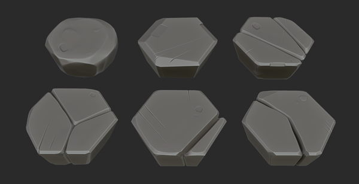
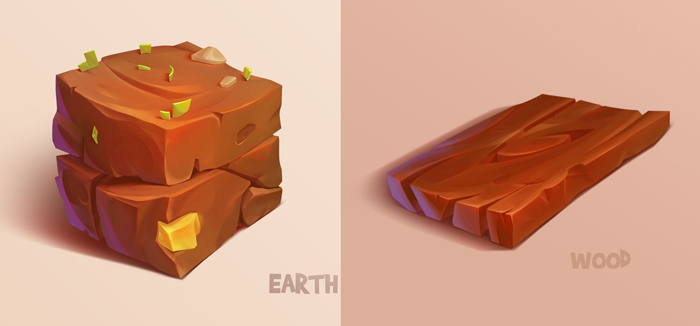
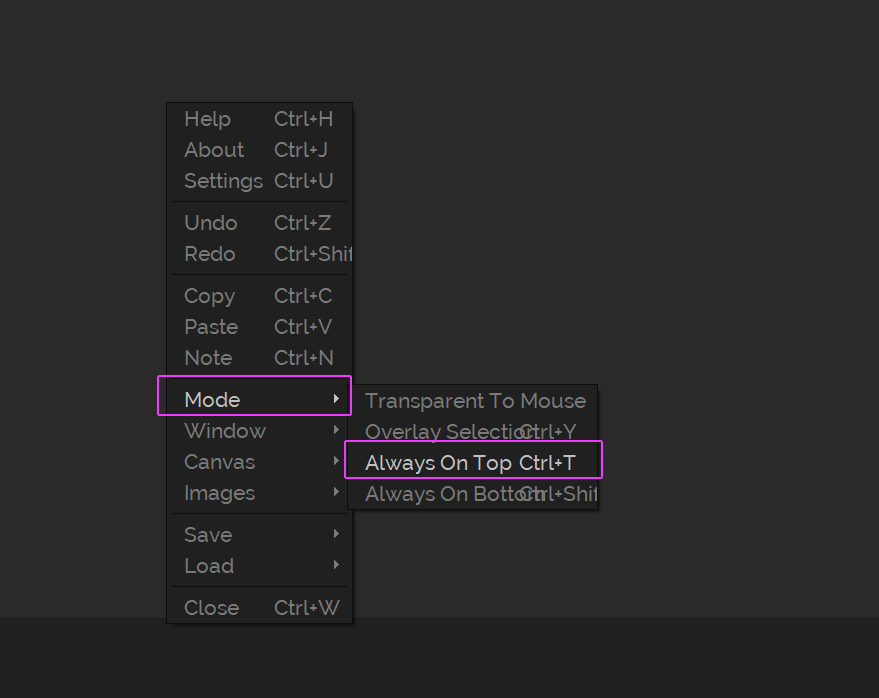
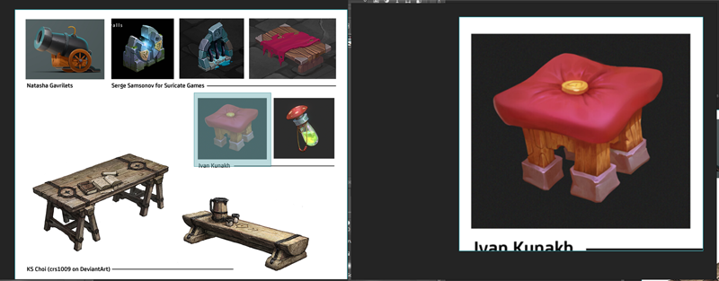
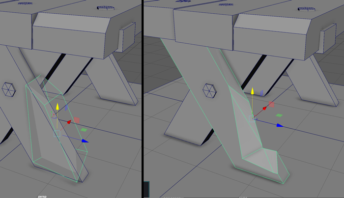
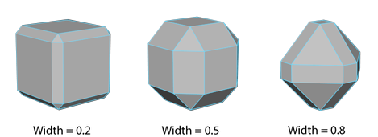

## Homework review (Week 1)

## Assignment 1
Model and render a _**prop**_. Things found in a game that isn't part of, say, the tiling environment. Treasure chests, tools, candle stands, computers, siege weapons, furniture, guns.
> **Prop** _(noun)_: An item in a scene distinct from the characters and static environment

NOTE: We won't be designing anything from scratch.

Lets **check out the brief** on [subject's assessment page](https://laureate-au.blackboard.com/webapps/blackboard/content/listContentEditable.jsp?content_id=_8008757_1&course_id=_75841_1&mode=reset) on Blackboard.

### Choose your concept

Let's pick something achievable and fun to model. You have **30 mins** to:
1. Pick a prop to model from the concepts below
2. Decide how you think you'd model the parts of the prop.
3. Think about any changes/additions you'd like to make. Think about how those would be made.

> **Cartoony models:** They're pretty low detail and chunky. Aim to block out first, and then add the bounce and dynamism.
> **Gritty-realcore models:** Block them out, then look to add details like bands, rivets.

#### The Options:

<!--
### Presentation

30 mins **Present** Come up front and describe what you'll model. Classmates can offer ideas, constructive thoughts.
  1. What did you choose and why?
  2. Are you making any changes?
  3. What bits do you feel like you can already make (and how)?
  4. What's a part you're very unsure about? (each concept potentially has that)
-->

<!--
## Block out time
Now you need to try things, find the barriers, the challenges you'll need to overcome

So start **blocking out** your models. We're just going for **big shapes**.
  - Aiming for proportions and feel
  - Primitives with some scaling
  - Cut off parts where needed
  - Make sure you move around and hit all needed pieces. Don't stop to detail.
-->
## Setting up for your assessment

Assessment 1 Base file, [download it here](DannyMcGillick_A1Prop_ACR103.zip)

1. Double click the zip to view the contents.
2. Drag the folder inside (DannyMcGillick_etc) into your computer's torrents/aac202 folder. It contains two folders.
3. Place the png or jpg of your concept (that you've already cut out) in the ref_a1Prop folder.

### Concept reference: don't work blind!

1. Start up a new pureref document, make it smallish and set it to always on top.
2. Drag and drop your concept image into it.
3. Save it into `ref__a1Prop` as `object_concept.pur`, using your object's (chair, table, cannon) name.
4. We'll do a similar thing below for the style reference.

### Style Reference
Damage

_Timo Ehrenfellner on Arstation_

* Shields, walls, and tables in raucous taverns can take blows from axes and swords. 
* Rocks can split just from overnight dew and frost. Collisions can knock corners off stone blocks.

_Firrka on Arstation_

_Orb/Vicente on Artstation_

### Hotkeys/reminders for Pureref

**_Pureref opens as a plain, dark grey rectangle._**

  
**_Set Pureref to be always on top with the right click menu._**

_**c-drag a square selection to crop, ctr-alt-drag the image to resize**_

* **Right click** to move pureref
* **Middle drag** to move canvas inside program
* **Left click/drag** to move image
* **Ctrl-V** to paste a copied image in, or **drag drop**
* **ctrl-alt-drag** on an image to resize
* Choose image/s and **ctrl-shift-r** to resize document to match
* Choose a cropped image and **ctrl-shift-c** to remove cropping.

## Modeling demo

I'll continue blocking and partly refining a model.

### Clean up! Rename things first

Amazing time saver. 

Select similar objects (in outliner or scene) then rename them from the right end of the modeling toolbar [like in this video:](http://raconteuranimation.com/10-second-maya-tips-rename-multiple-objects/)

### Splits and gouges: multi cut, bridge.

Multi cut can add edges between vertices, add new loops, or get serious and cut through any geometry in any direction. It's manual and slow, but gives control.

We can:
1. Creat the outline of our missing chunk
2. Select and delete the unwanted faces.
3. Select and bridge edges to create new faces.
  
Learn more about multi cut to add all the extra edges you need.
  * [Youtube tute by Jofftech](https://www.youtube.com/watch?v=4reh8fRLPT0), demoing features/tendencies, providing shortcuts.
  * [Autodesk knowledge base](https://knowledge.autodesk.com/support/maya-lt/learn-explore/caas/CloudHelp/cloudhelp/2019/ENU/MayaLT-Modeling/files/GUID-12DF0D57-6E5E-48E3-8FBF-F787BA4E5410-htm.html) 

### Booleans

We saw these pictures of boolean operations last week. Let's see them work in Maya.

Select your objects in this order:
1. Object A: This will be retained
2. Object B: This will be subtracted from A.

In the top menu, click _Mesh -> Booleans -> Difference_.

### Bevel an edge

Wear takes off edges. So do carpenters with routers.

Beveling a single edge.

Beveling after a boolean.

Bevels on [Autodesk knowledgebase](https://knowledge.autodesk.com/support/maya/learn-explore/caas/CloudHelp/cloudhelp/2019/ENU/Maya-Modeling/files/GUID-A1C5EC72-AD48-4A7D-8577-1823B3832E14-htm.html)

### The pivot point

**Press d to enter pivot edit mode**
  - **click** on features to **snap**
  - **v drag** to snap to **vert** (applies to vertex transforms too)
  - **x drag** to snap to **grid** (also applies to vert xforms)

### Transform options

Can be changed via the modelling toolkit or double clicking the transform controls on left side toolbar.
* Control what you **xform relative to**: world/object/tangent/normal and other
* Control what happens when **snapping with multiple elements selected** (maintain distance)
* Also available in w-right-click, e-right-click and r-right-click context menus

### Channel Box

* Changing parameters on newly made primitives
* Precise position/rotation/scale
* Renaming (along with outliner)

<!--
### Freeze transformations

### Bevels

### Amputation with Multi Cut

### Joining with Bridge

### Booleans

### Thin things ( not a big detail)

How would you do thin things without a nightmare of selecting.?

_**- bendy strap box with things close together -**_

We can make that as a flat surface, then thicken later.
* Start from a plane with only x axis divisions
* Start from a box, delete back and side faces.
* Use Quad Draw feature (will need home learning with videos and practise, but big rewards)

_**- picture of flat ribbon -**_

### N-gons

-->