## Assessment 1 Received 

Thanks for assessment 1 submissions.
* Haven't yet looked through submissions. If I find major issues I'll let people know.

## Weeks 5-8, modeling game environments

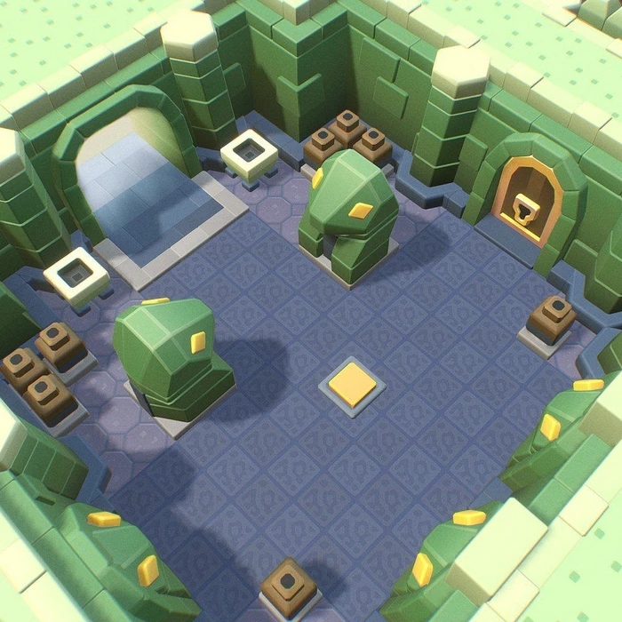

We'll learn about:

#### Modular modelling
  - Assembling usable level pieces from basic components
  - components like floors, walls, columns, doors
  - level pieces like repeating wall with floor, corner of room etc

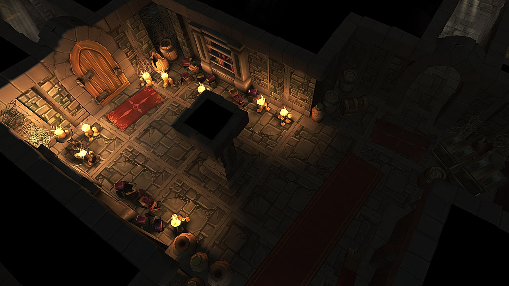
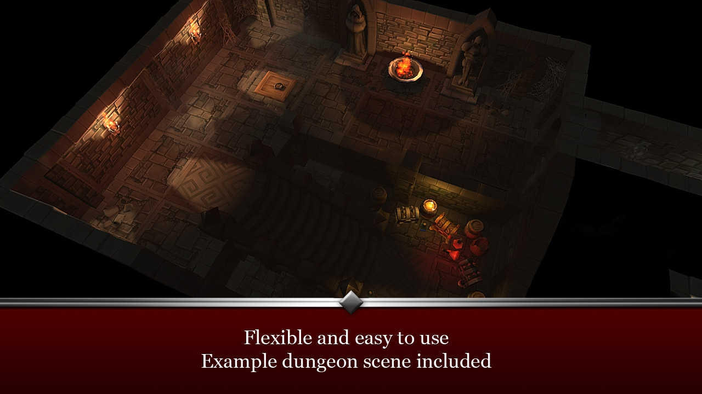
_Levels made from modules_

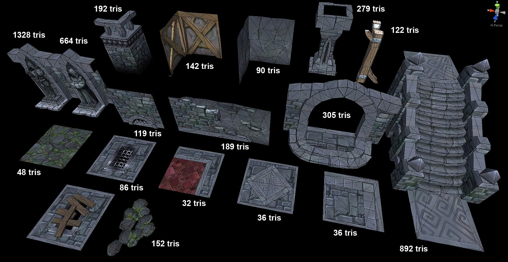
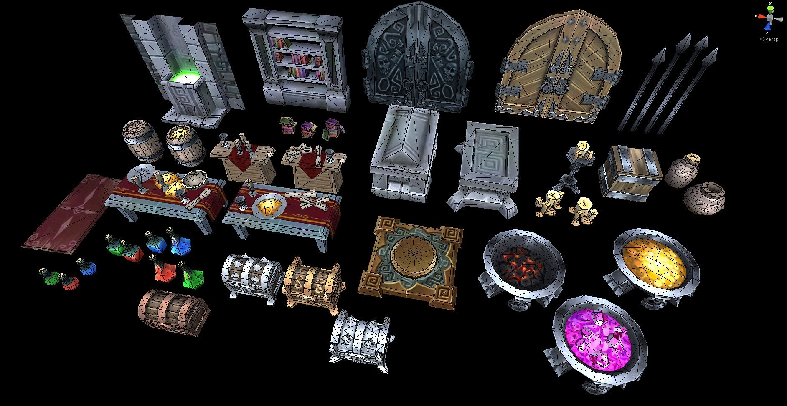
_Components for making modules_

| Objects     | Component     |
|------|--------|
| wall        | basic component |
| floor       | basic component |
| wall+floor  | wall_floor module |
| 2 walls + floor | wall_floor_corner module |
| 5 x wall_floor + column  | one side of a corridor? | 

## Wacom Tablets

Get one!

## This week

Beginning the assessment, practising working to a grid.

### Modules and components 

A little more context. 

_Notice one road lane component and one sidewalk component making up a module. Look for more._
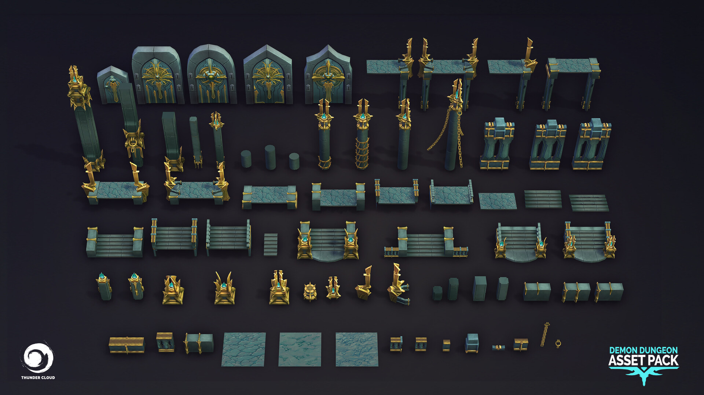
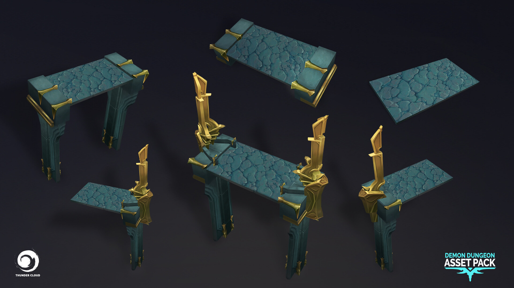
_Components being arranged to make ledge/raised walkway modules_

## Modular modeling

<!--
> TODO: add this file
> First, play in this scene to see what we'll be doing.
>
> Make some modules by duplicating (ctrl-d) and moving components:
>  - select translate tool (w)
>  - enable grid snapping (hold down x)
>  - click and drag the translate handle
> -->

Making pieces that snap together means using standard measurements so they meet up at the corners. It also means choosing a pivot point for each part that makes sense.

* Set up grid

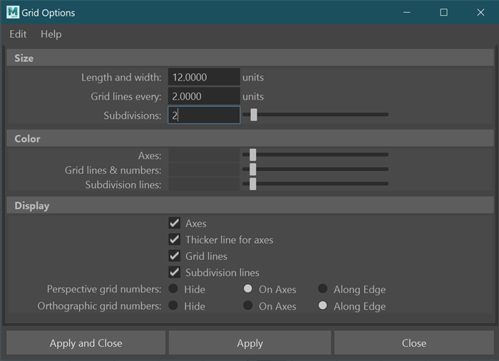
  
* Make a wall plane, a floor plane
* Move our pivot points using d (modify pivot)
  - select translate tool (w)
  - select an object
  - enable pivot editing (d)
  - you can move pivot freely by dragging handles
  - enable snap to vertex (hold down v), click and drag manipulator handles.
  - disable snap to vertex (release v)
  - disable pivot edting (d)
  
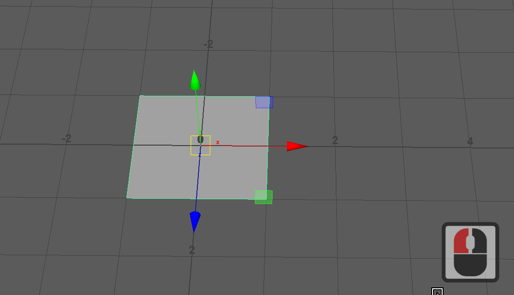

* Move and snap our objects. Duplicate, move w snap.
  - select translate tool (w)
  - enable grid snapping (hold down x)
  - click and drag the translate handle
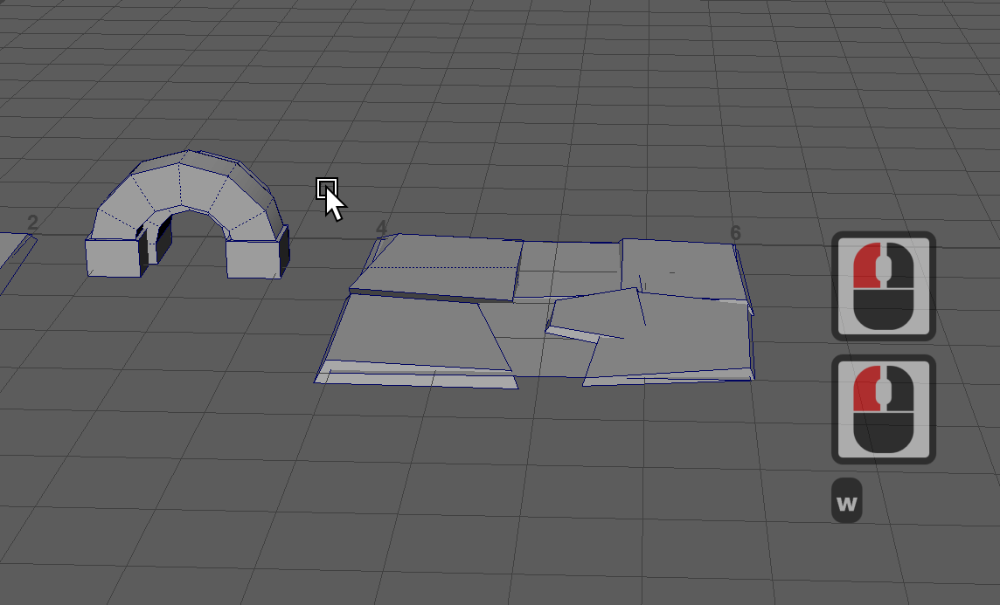

When you have your pivot set, and your object at the origin, you're going to be stuck with funny x and z coordinates, and maybe leftover rotation. Remove them with "Freeze Transforms"
* Select your objects
* Right Click the channel box as in the gif below and freeze all transforms.
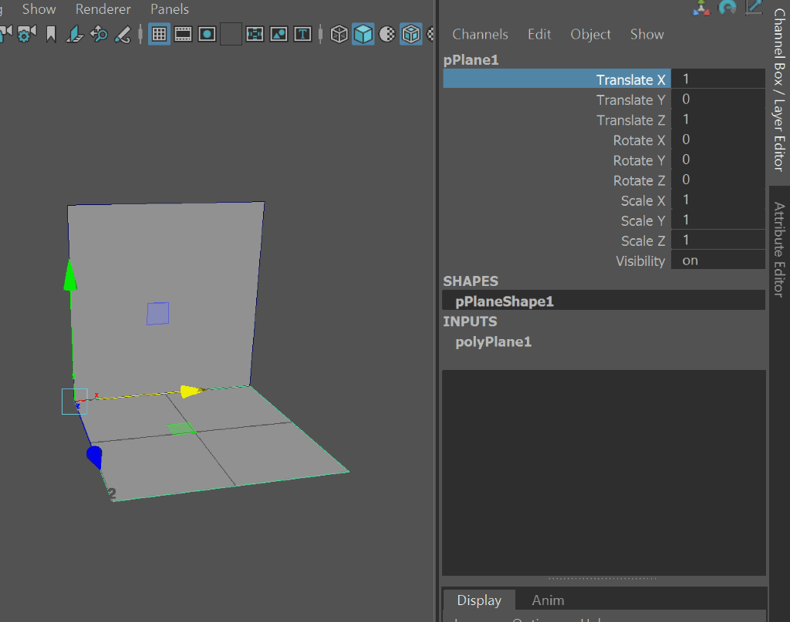
_Your new level component should be all 'zeroed out' with its pivot at the origin_

* Make a column
* Move pivot, duplicate, move w snap.

## Assessment 2: Environment Modelling

Assessment 2 brief [on blackboard](https://laureate-au.blackboard.com/webapps/blackboard/content/listContentEditable.jsp?content_id=_8920016_1&course_id=_91934_1)

 You will be choosing, interpreting, building and lighting a 3D environment. 
 
 * You'll be provided with a range of existing 2D environment concepts and finished 3d environment assets to use as a guide.
 * You can modify the scene from say a level 1 dungeon to level 5 dungeon, or a lounge room to an attic bedroom). * You can add elements that aren't there, but aim to match them stylistically
  
**OPTIONS**
1. Dungeon crawler world (games like diablo)
2. Interior scene:
   a. modern home interior
   b. fantasy interior
3. Cartoony tiered environment (see concepts)
4. Suggest and discuss with Danny (facilitator)

**TECH SPECS, CREATIVE DIRECTION**
1. Keep polycount low. Elements between 20 and 100 polys roughly.
2. Strong focus on modularity: reusable pieces, fitting to a grid, instancing.
2. UV unwrap models
3. Keep textures minimal with little lighting. Keep individual textures at 512x512 or lower (256, 128, 64)
4. Export to Unity and apply baked lighting (AO)

**DELIVERABLES:**
Week 6:
* Designs and first renders on class forum (blackboard)
* 10-15 untextured components, arranged into modules
Week 12:
* Unity project with interactive fly through (camera using a basic unity-provided controller script)
* Maya project

### How will we do it all?

- Choose and modify/extend a concept
- Model and uv unwrap in Maya
- Test with a texture designed to help uv mapping
- Export to 3D Coat/Photoshop for texturing.
- Import components to Unity
- Make simple prefabs
- Snap pieces together

### Choose your environment and style

Lots of styles and concepts at the end of these notes, many more on [my acr103 pinterest board](https://www.pinterest.com.au/dmacdraws/acr103/)
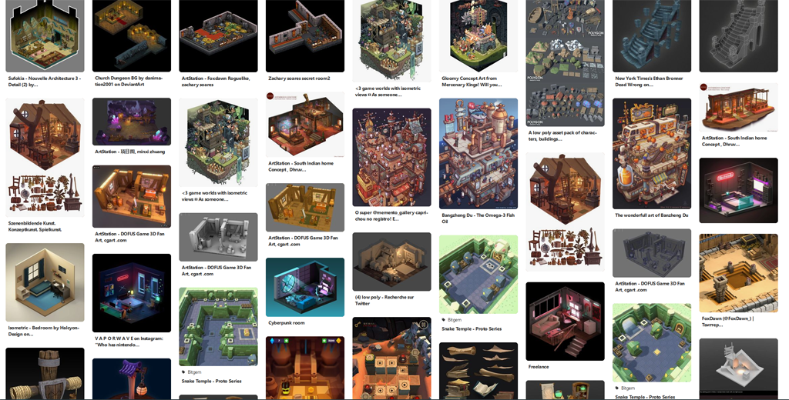
Can match existing style as closely as possible, work directly from concepts in 2D.

### Rough design of your level
Sketch out an approximation of your idea (obviously more refining at home!)

### Figure out components you'll be making.
Getting started here. What do you see in the image? wall, flor, railing, stairs, column, sign?
