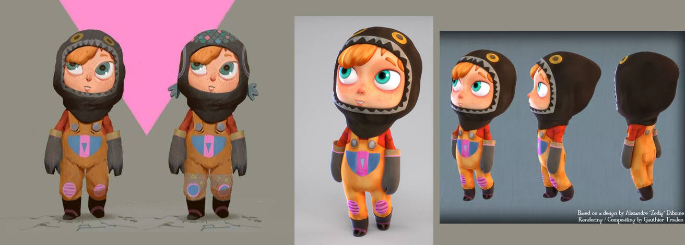
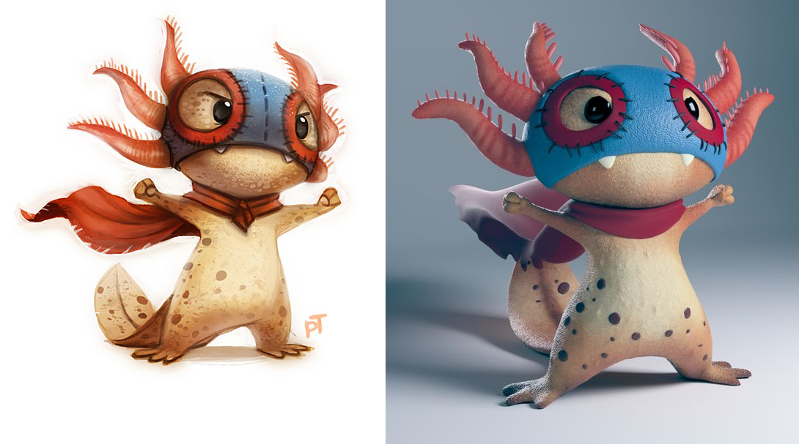
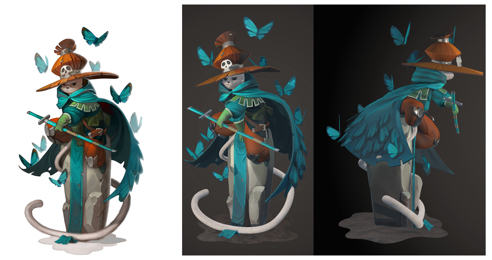
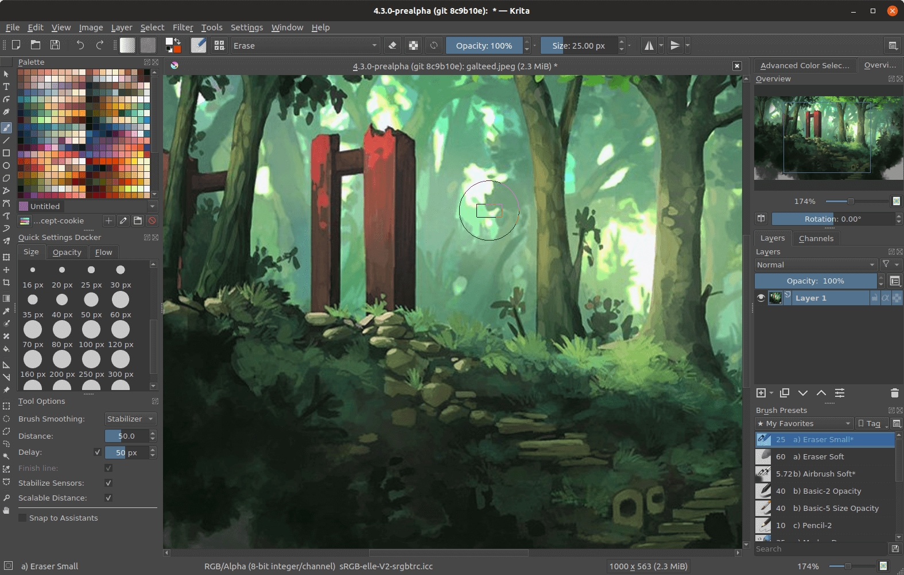

## Character Modelling Priorities

1. Matching the concept
2. Working to a 3D style
3. Using few polygons.

## Character modeling!


_Mira by [EelGod on Deviantart](https://www.deviantart.com/eelgod/art/Mira-Model-570220497)_

It's a deep subject
It includes:
* Prop and hard-surface modeling skills
  - They have props on them, they wear armor/tech
* Knowledge of anatomy, and mechanics of movement 
* Understanding of facial expressions and how to support them
* Great subtlety: the brain dedicates a lot of neurons to recognising human faces and forms. Tiny differences stand out.


>**Anyone\* can learn**, it's just practise + study:
>- Anyone who is super invested
>- It requires a disgusting amount of hours put in
>- That's before and during a career, at work and at home

### Biting off what you can chew

We're learning a bunch at once: 
1. how to model a character from concept + style reference 
2. How to uv unwrap.
2a. How to uv unwrap a character, which is specialized
3. How to use 3D coat and photoshop in texturing
4. How to paint stylized characters for games
  
**That's more topics than we have weeks.**

The answer: we'll choose and model simpler, stylised characters with low polygon counts.


Once you get started texturing, it's up to you (and how much time remains) how far you take it.


## Assessment 3

Modeling and diffuse texturing a character.
> Diffuse texture: the colour layer for a character. As opposed to: normal map, specular map, metalness map etc.

<a class="btn btn-lg btn-primary mr-3 mb-4" href="https://laureate-au.blackboard.com/webapps/blackboard/content/listContentEditable.jsp?content_id=_8920017_1&course_id=_91934_1" target="_blank">Assessment 3 On Blackboard<i class="fas fa-arrow-alt-circle-right ml-2"></i></a>


### Deliveries by week

I'll be tracking discussion post updates each week, and this will feed into your marks on discussion participation and use of in-class techniques (30% of assessment marks)

We'll be posting in [the Assessment 3 forum
](https://laureate-au.blackboard.com/webapps/discussionboard/do/conference?toggle_mode=edit&action=list_forums&course_id=_91934_1&nav=discussion_board_entry&mode=cpview)

#### Week 10 Wednesday

Due **Weds Aug 5th**, the day _before_ class day. Update discussion post with:
* A screenshot of pureRef displaying your :
  - 2D Concept image
  - 3D modeling/texturing style reference
* Discussion of what attracts you to the character concept and why you chose the style reference
* Screenshots of your 3D model in Maya showing its topology and form.

### Week 11 Wednesday

Due **Weds Aug 12th**, the day _before_ class day. Update discussion post with:
* Links to two other students' threads where you've commented on their model topology from week one
* Two Maya screenshot of your UV unwrapped character
  * In Maya's UVS workspace: perspective panel, uv editor.
  * With _image->dim_ enabled in uv settings so wires are clear
  * All character pieces selected so all uv wires are shown.
  * One shot with checkerboard turned on to show even coverage
  * Another shot with stretch/distortion hilighting enabled 
* A screenshot of your character in 3D Coat with baked ambient occlusion and first pass flat colours.

### End of week 12

Your final character model with texture applied.
More info incoming.

By 11:55pm week 12, **August 23**

## Why style reference?

Because you don't have a 3D style yet!

Because 3d outcomes can be veeery different from 2D. Also, every 3d art decision can go as many ways as a 3d decision, so styles are complex and can't be made up along the way.

Because when you work on a game you 3D model/texture to a style, just like 2D artists/character designers work to a style guide.

### 2D and 3D side by side

Here are some examples of what people have done with 2d concepts in 3d. (Several are more high poly 3D but the lesson is the same)








## Choose your concept and style ref 

You'll need a pinterest account.

1. Choose a concept from [the character concept board](https://www.pinterest.com.au/dmacdraws/acr103/a3-character-concepts/) 
2. Choose 3D style reference from [the style reference board](https://www.pinterest.com.au/dmacdraws/acr103/a3-3d-style-reference/)


### On choosing a concept

We won't be using our own concepts for this.

Here's a discussion between the Flipped Normals guys (industry pro character modelers and teachers) about why modeling from your own concepts is a bad idea for early learning and making portfolio pieces:
[](https://www.youtube.com/watch?v=42pALQQefDk&t=722s)
_The meant to say: don't (or rarely) use your own concept art for 3D modeling when learning_

## Model with me

### Priority 1: Folder organisation

If you go in without a strategy, files and folders for even a single application like Maya or Unity get messy fast. 

> "Mess is the enemy of productivity." - every professional ever.

Let's start by making a folder structure. Here's an example I might use if I was modeling this Janice Chue concept:


```cpp
- acr103
  - assess
    - a3_crownBird
      - 3dc__cbird      // 3D coat working files
      - maya__cbird     // maya project in here for modeling
      - pshop__cbird    // photoshop texturing etc
      - ref__cbird      // pureref and plain image reference
```
      
### Concept art and Pureref refresher

If you don't have Pureref already, Grab this download: [PureRef portable
](pureref_port_192.zip)
_PureRef holding my outlines during modeling_

* Open [the assessment 3 character concept board](https://www.pinterest.com.au/dmacdraws/acr103/a3-character-concepts/) in a new window
* I'll pick a pretty basic character. 
* Copy paste it into PureRef

> **SHORTCUTS**
>These are also in the help section and keyboard shortcuts preferences
> **ctrl-v** paste image. (cmd on mac)
> **Right drag** to move app
> **left drag** to move image
> **ctrl-alt-left drag** to resize image
> **c-left-drag** to crop an image
> **ctrl-shif-c** to uncrop
> **ctrl-shift-r** resize app to current selection

### Maya project setup refresher

Setting up project and folders.
Enabling autosave (if not set)

### Style reference

Let's drop style reference into pureref.

Style reference is critical
* You don't have a go-to style yet
* There are maaaany ways to translate 2D to 3D
* It's often not covered in the concept, and never 100% covered
* Even if you did have a style you usually model to a style guide for a game
  


## Modeling a basic character for texturing

There's a lot to consider. Some of it will be solved by the style reference we just grabbed.

* Poly count HUD
  - Sanity check
  - Helps find and fix unmerged verts etc
* Identifying what needs geometry, what can be painted in.
* Minimum geometry for maximum value
* Blocking out character first
* Setting objects to template/reference/x-ray mode so they can be used as guides
* A limb is a cylinder: how many sides? 5? 6? 8? 16? 
* How do we nicely merge limbs into body
* Importance of hard vs soft normals

## Homework 2: Read up.

### Texturing and UVs

Textures are 2D images wrapped around 3D objects. Think of a cereal box: if you open the ends and cut down one long edge of the box, it can all be layed out flat.

To see the cereal box taken to fun places, check out papercraft toys:


[](papercraft_dracula.pdf)
_Click unfolded Dracula to download a pdf pattern_


[](papercraft_tougui_sweet_monster.pdf)
_Click unfolded monster to download a pdf pattern_


_No PDF: just download this picture to make a lootbox_

### Textured characters: like vinyl wrapping


_Various layers of pbr texturing applied to DVa as images_

### Good and Bad UVs

**Objects have a default uv layout** when Maya creates them. Usually they become badly **distorted** as you model.

Think of when you try to wrap a christmas present. Wrapping paper has no stretch to it, so it wants to crunch up in some places and threatens to tear in others. If it was stretchy and sticky, you could get it to follow the surface, but it would stretch and compress the reindeer on the wrapping.


When we uv unwrap we kinda have that sticky, stretchy material. The challenge is to find ways to reduce that without stretching the image too much. 


_One side looks blank, the other is striped and full of errors_


## Start Unwrapping (if time allows)

### Create new starting UVs:
  
  - Go into Maya's UV workspace
  
  - In the perspective view, tumble and look the model from above at 45 degrees, like in the image below
  - UV Tookit -> Create -> Camera-based
  
  
The new UVS are distorted in 2D to resemble what the camera saw. They're all joined together like the mesh too. We need to cut it like papercraft.

### Cutting and unfolding
  - In edge mode, select (and shift select) edges to cut
  
  - UV Toolkit -> Cut and Sew -> Cut
  
These next steps were all done by hand previously (and often still are):
  - Select all edges
  - Uv Toolkit -> Unfold -> Unfold
  - Uv Toolkit -> Arrange and Layout -> Auto Orient
  - Uv Toolkit -> Arrange and Layout -> Layout
    - We'll try to roll with default here
  
  _Unfolded, oriented, then laid out. Colours altered in photoshop._

Unfold and Layout have plenty of settings. Lets have a look at good settings to start with.

**To be added soon: Unfold and Layout settings pics
**

## Next week character uv and paint.

We'll talk more on character unwrapping as you get your models prepped for 3D Coat. Being so rounded, figures provide a lot of stretchy challenge.

Compare the last two bearbricks on this sheet: iron patriot is carefully designed to avoid any stretching, pattern bear.. is less so.


## Resources 

### Uv tutorials

I haven't watched yet:

[
_Bunny unwrap tute made in 2018_](https://www.youtube.com/watch?v=VHUJ-kte1n8)

### Krita painting app
If you don't have photoshop at home, Krita is a great free alternative. 
* For your own machine you can [download the full installer,](https://krita.org/en/download/krita-desktop/)
* On a uni workstation you'll need the portable (runs without install) version:
  - [Download Krita portable for Uni workstation](https://sourceforge.net/projects/portableapps/files/Krita%20Portable/)




### Kelvin Tan teaches 3D Coat

I first learned how to texture in 3D coat from Kelvin's sci fi gun tute. He's a (former?) Blizzard artist who worked on WoW. Along the way he drops knowledge on lighting, design, readability and more.

[His tutes on Gumroad](https://gumroad.com/turpedo#uYYtu) are paid ($10 US for the gun tute) so I can only suggest that it's very, very worth your money. And more.

[](https://gumroad.com/turpedo#uYYtu)
