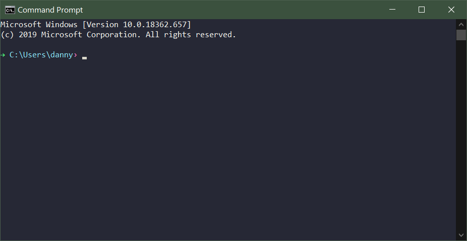
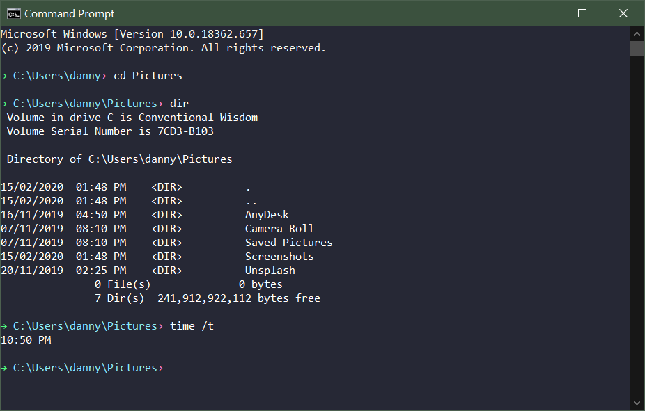

## Software Requirements

Before we can do any programming, you need to have the right software on hand. If you haven't installed _Visual Studio_ and _Flowgorithm_ follow the link:

<a class="btn btn-lg btn-primary mr-3 mb-4" href="/torrens/ise102/resources">
  ISE102 Resources
</a>

## What Is Programming?

Programming evokes the idea of computers and code and binary. That's just the end of the process, the execution. 

Programming at its heart is something much more basic: **describing how a task is done**. 


If a baker writes down a recipe for her chocolate ganache, she's writing a program that causes another human to reproduce that tasty dessert.


### It's Just Instructions

I don't just mean computer instructions, I mean any instructions!


Giving instructions is something we learned at school and at home.


Maybe you haven't written a recipe, but **you've given someone instructions**. Maybe you asked your dad to drive you to your friend's house. When you told him the time to leave and your friend's address, you could say you did some _Parental Programming_.

{}
My 3 year old son is an expert programmer of parents. When he wants warm milk but can't instruct the microwave to prepare it, he **instructs an adult:**

```
// Here is the program Harvey speaks to his mum:
"Mum, I want a bottle please. Can you make it better?"
```
{}

### Interpreting The Program

Mum, like any good computer, has an _**instruction set**_. Each instruction encoded in Harvey's program translates predictably an action she can perform:

```
Instruction: "Mum"
Action: Begin accepting program input

Instruction: "I want a bottle please"
Action: Place 250ml of milk in a baby bottle

Instruction: "Can you make it better?"
Action: Warm it for 40 seconds in the microwave.
```

## Requirements For Programming

Mum was able to infer a lot from Harvey's simple instructions. There's something going on there, some rules of communication they're using.

Let's break them out by looking at what Dad needs to drive us to our friend's house.


Dad remembering the days before he had kids.


### What Do We Need For Dad Programming To Work?

1. **Dad**, so we can program him
2. A list of **instructions** for him to follow, eg
    - Drive me in the car
    - At this time
    - Along this route to my friend's house
3. A common **language**:
    - Something you both speak to people in general
    - Better: particular phrases and keywords known to **motivate** dad.
4. A **car** for him to drive and some **roads** to drive on

### What We Need For General Programming

If we remove the dad, the car and the route, we have a handy way thinking about programming a human/device to solve a given problem: 

1. A **_subject_**
   - A human (dad) or a computer that you will you program to do the work
1. A list of _**instructions**_
   - Steps which, performed correctly, will lead to a completed task.
1. A common spoken/written _**language**_
   - An agreed _grammar_: how the words are arranged to have meaning.
   - An agreed _instruction set_: keywords which trigger actions in your subject.
1. An agreed setting or **_context_** where the work happens:
   - Dad (_subject_) needs a car and the roads (_context_) to do the work

#### Summarised

For a given **task or problem**, we need:

| Requirement     | Description                           |
|-----------------|---------------------------------------|
| _Subject_       | The device or creature doing the work |
| _Context_       | Setting where the work is applied     |
| _Language_      | Words and grammar                     |
| _Instructions_  | Steps required to complete the work   |
-----

## Programming A Computer With C++

Okay, before we get to the actual task or problem, we can apply three rows of the table:

### Subject: PC

This is easy. The subject is a computer. In our case a **PC with an Intel Processor**, with all the usual bits and peripherals (keyboard, mouse etc)

### Context: Windows Command Prompt

We're going to make a text-based program. To do that we'll use the _Windows Command Prompt_:


<br /><br />
Windows, at its heart, is an **operating system**. It takes all those bits of silicon, gold, copper and plastic, and makes them work together. The thing you're used to using, with _Explorer_ windows and the _Start Menu_ is a thing that sits on top, called a **window manager**.

Under that lives the beast that actually controls network cards, drives the monitor, moves files around drives, sends sound to the speaker etc. It's the **kernel**. _Windows_, _MacOS_ and _Linux_ all have one.

Before we had fancy graphical window managers,regular users were met with a black screen with some text on it. You typed in commands to run programs, and they controlled the kernel:


<br /><br />

`cd` (_change directory_) is a program for changing into a folder, `dir` (_directory_) lists the contents of a folder and so on.

### Exercise

Open the Command Prompt and try out the commands above for yourself.

1. Press the `Windows` key, next to `Alt`.
2. Type `Command Prompt` and hit `Enter`.
3. Type the commands in the screenshot, hitting `Enter` after each.
4. Also try these commands:
    - `echo I am a computer`
    - `echo %PROCESSOR_IDENTIFIER%`
    - `ping www.reddit.com`


## Storage

Memory boxes. Memory that can have variable contents. Instead of calling them variable memory boxes, call them simply **variables**.

## Summary

* Install the required software
* Programming is just a list of instructions to complete a task
* A computer/person is mostly input/storage/processing/output
* You already program things, you're just learning how to apply it to a computer.

* To program you need:
  - Language
  - A subject you will program with that language (human, computer)
  - A list of instructions (in an agreed grammar, from an agreed upon instruction set)
  - An agreed place the subject can do the work (car, kitchen, _Windows Command Prompt_)

* We made a simple game, Knights Journey, with help from our 4 basic categories (input, storage etc)
  - Once, in _Visual Studio_ with _C++_, for the _Windows Command Prompt/Console_
* We made it again visually, in _Flowgorithm_.


## Homework

Read through **pages 1-12 of Chapter 1** of the textbook, _**"Beginning C++ Through Game Programming"**_ 
  - Create a Visual Studio project for called GameOver3, using the ise102_console project type.
  - Replace the contents of main.cpp with the code of the Game Over 3.0 program (pages 11-12)
  - Run it with the `ctrl + F5` hotkey, or select _Debug -> Start Without Debugging_ from the menu bar.
  


