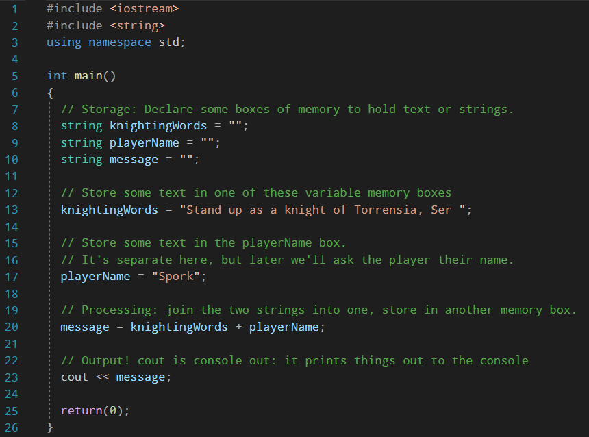
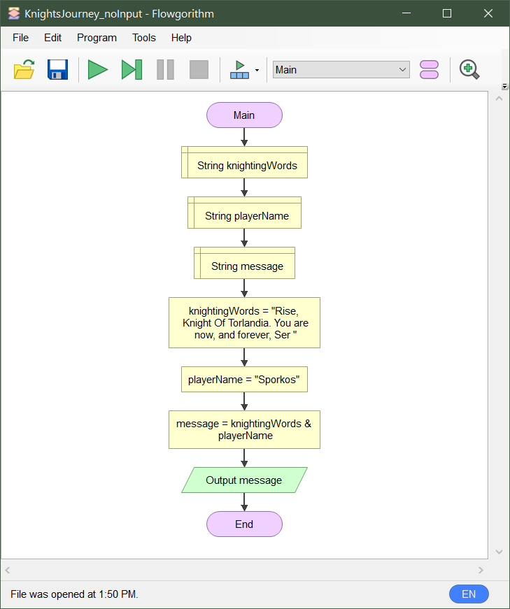
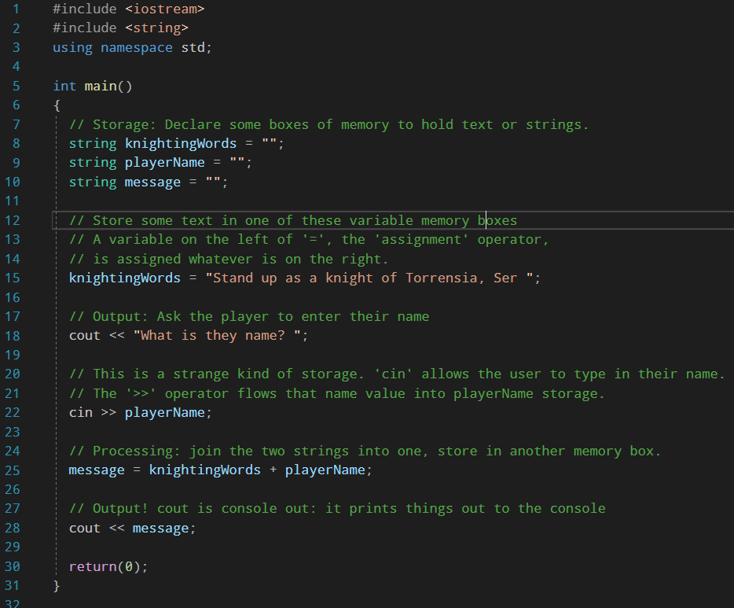
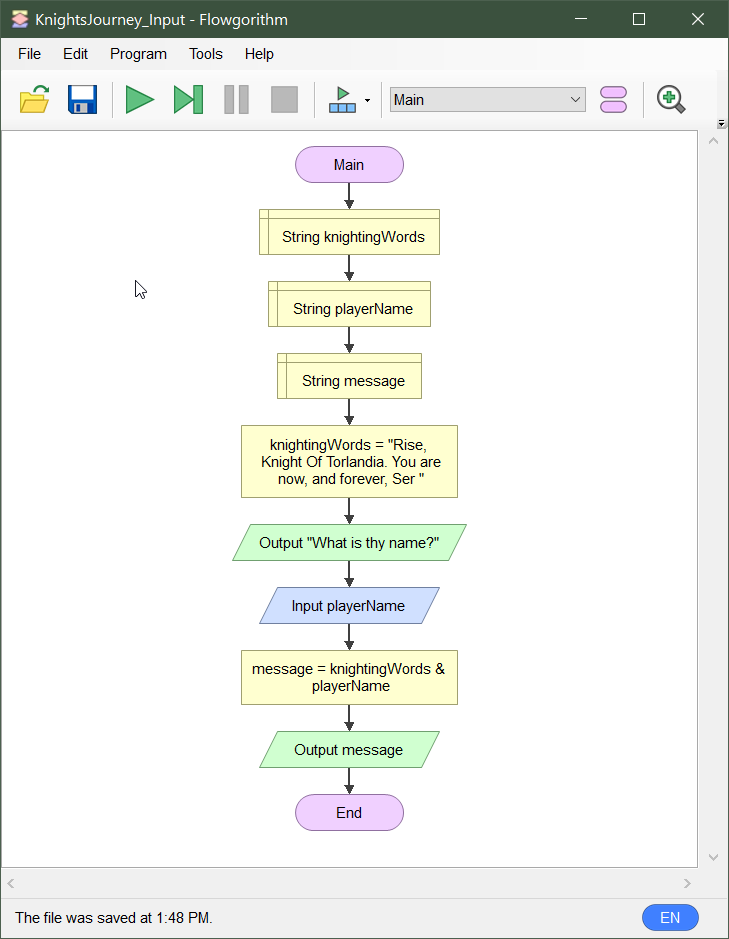

## Software Requirements

Before we can do any programming, you need to have the right software on hand. If you haven't installed _Visual Studio_ and _Flowgorithm_ follow the link:

<a class="btn btn-lg btn-primary mr-3 mb-4" href="/torrens/ise102/resources">
  ISE102 Resources
</a>

## Hello!

Some people are still installing, so let's get acquainted.

## What Is Programming?

Programming evokes the idea of computers and code and binary. That's just the end of the process, the execution. 

Programming at its heart is something much more basic: **describing how a task is done**. 


If a baker writes down a recipe for her chocolate ganache, she's writing a program that causes another human to reproduce that tasty dessert.


### It's Just Instructions

I don't just mean computer instructions, I mean any instructions!


Giving instructions is something we learned at school and at home.


Maybe you haven't written a recipe, but **you've given someone instructions**. Maybe you asked your dad to drive you to your friend's house. When you told him the time to leave and your friend's address, you could say you did some _Parental Programming_.

{}
My 3 year old son is an expert programmer of parents. When he wants warm milk but can't instruct the microwave to prepare it, he **instructs an adult:**

```
// Here is the program Harvey speaks to his mum:
"Mum, I want a bottle please. Can you make it better?"
```
{}

### Interpreting The Program

Mum, like any good computer, has an _**instruction set**_. Each instruction encoded in Harvey's program translates predictably an action she can perform:

```
Instruction: "Mum"
Action: Begin accepting program input

Instruction: "I want a bottle please"
Action: Place 250ml of milk in a baby bottle

Instruction: "Can you make it better?"
Action: Warm it for 40 seconds in the microwave.
```

## Requirements For Programming

Mum was able to infer a lot from Harvey's simple instructions. There's something going on there, some rules of communication they're using.

Let's break them out by looking at what Dad needs to drive us to our friend's house.


Dad remembering the days before he had kids.


### What Do We Need For Dad Programming To Work?

1. **Dad**, so we can program him  
2. A list of **instructions** for him to follow, eg  
    - Drive me in the car  
    - At this time  
    - Along this route to my friend's house  
3. A common **language**:  
    - Something you both speak to people in general  
    - Better: particular phrases and keywords known to **motivate** dad.  
4. A **car** for him to drive and some **roads** to drive on  
  
### What We Need For General Programming  

If we remove the dad, the car and the route, we have a handy way thinking about programming a human/device to solve a given problem: 

1. A **_subject_**  
   - A human (dad) or a computer that you will you program to do the work
1. A list of _**instructions**_  
   - Steps which, performed correctly, will lead to a completed task.
1. A common spoken/written _**language**_  
   - An agreed _grammar_: how the words are arranged to have meaning.  
   - An agreed _instruction set_: keywords which trigger actions in your subject.  
1. An agreed setting or **_context_** where the work happens:  
   - Dad (_subject_) needs a car and the roads (_context_) to do the work  
  
#### Summarised

For a given **task or problem**, we need:

| Requirement     | Description                           |
|-----------------|---------------------------------------|
| _Subject_       | The device or creature doing the work |
| _Context_       | Setting where the work is applied     |
| _Language_      | Words and grammar                     |
| _Instructions_  | Steps required to complete the work   |
-----

## Programming A Computer With C++

Okay, before we get to the actual task or problem, we can apply three rows of the table:

### Subject: PC

This is easy. The subject is a computer. In our case a **PC with an Intel Processor**, with all the usual bits and peripherals (keyboard, mouse etc)

### Context: Windows Command Prompt

We're going to make a text-based program. To do that we'll write a program that runs in the  _Windows Command Prompt_:


<br /><br />
Windows, at its heart, is an **operating system**. It takes all those bits of silicon, gold, copper and plastic, and makes them work together. The thing you're used to using, with _Explorer_ windows and the _Start Menu_ is a thing that sits on top, called a **window manager**.

Under that lives the beast that actually controls network cards, drives the monitor, moves files around drives, sends sound to the speaker etc. It's the **kernel**. _Windows_, _MacOS_ and _Linux_ all have one.

Before we had fancy graphical window managers,regular users were met with a black screen with some text on it. You typed in commands to run programs, and they controlled the kernel:


<br /><br />

`cd` (_change directory_) is a program for changing into a folder, `dir` (_directory_) lists the contents of a folder and so on.

Why is it still in Windows? Because that's how a large portion of serious system administration is still done, by calling lots of programs in the command prompt!

#### Exercise
  
Open the Command Prompt and **try out the commands** above for yourself.
  
1. Press the `Windows` key, next to `Alt`.  
2. Type `Command Prompt` and hit `Enter`.  
3. Type the commands in the screenshot, hitting `Enter` after each.  
4. Also try these commands:  
    - `echo I am a computer`  
    - `echo %PROCESSOR_IDENTIFIER%`  
    - `ping www.reddit.com`  
  

### Language  
  
We'll be using **C++**, a programming language first created in the early 1980s.  

* Built on a language called C
* "Close to the hardware"
* In some ways dated
* At the same time it's the most relied on programming language on PCs. Where you'll find it:
    - Huge amounts of the code in Windows and Linux (more on MacOS later)
    - Major applications like Word, Photoshop and Chrome,
    - The game engines behind any AAA and most indie titles.
* Used in Planes, fridges, satellites, watches, particle colliders. (picture)
* Quite familiar to `Java`, `C#`, `ActionScript` programmers.
* Somewhat familiar to `Python` coders, and in some ways strange.
  
We'll use Visual Studio to write our source code and turn that into programs (though other environments exist).

### Instructions.

<div class="-bg-200 p-2">  
The rest of this class is going to be about turning a task into instructions for our PCs, then getting them to execute them. </div>  

To have instructions though, we need a task to complete or problem to solve!  

## Our first program: Knight's Journey


_**Knight's Journey**_ is going to be a game where you give your name, and are immediately made a Knight.

**The Computer's Task:** It has to know our name and then use the right ceremonial words to make us into knights. How do we instruct it to complete that task?

### Instructing The Computer

Before we write computer language, let's write the instructions in a language we know. English!

Computer, please:  
1. Ask us for our name  
2. Receive our name via keyboard  
3. Remember our name  
4. Know the special knighting words  
5. Combine our name with the knighting words  
6. Point out the resulting sentence, so we know we're knights.  


## Exercise: Knights Journey in C++

### Setting up

Visit the [ise10 Resources page](/torrens/ise102/resources/) and: 
1. Install Visual Studio Community 2019 with Desktop devopment in C++ (if you haven't already)
2. Get the _ise102_console_ template, add it to Visual Studio
3. Create a new Solution/project using the template.
4. Run the project to make sure it works by hitting `ctrl + F5` 

### Enter The Code

1. Select and delete all the code in `main.cpp`
2. Type in the following code, including the _comment_ lines starting with `//`

3. Run the program with `ctrl+F5`

## Don't Panic: Four Basic Features

People, like computers, feature _input, storage, processing and output_.

**Harvey's mum:**
  * Receives **input** via her ears, eyes and other senses
  * Her brain **stores** instructions and remembers events
  * She uses her hands and smarts to **process** the milk, moving it to a bottle and warming it
  * She **outputs** a warm bottle of milk and a kiss to Harvey.
  

When we take the (at least) thousands of components of a PC and group them into a few simple functions, we call it **abstraction**, and it's a very powerful tool.

Any complex task achieved by humans requires the use of abstractions: if we considered every object in its full complexity we'd grind to a stop!


Just have a think about what you're _really_ describing when you say "I was thirsty until I drank some water."  There are several Nobel Prizes in chemistry, physics, neuroscience and biology in that statement if you go deep enough!

## Four Basic Features of Computers

How do we turn these pretty simple instructions into something that controls the Frankenstein of components that is a computer?? 

While there are indeed lots of instructions you could give to a computer and its many parts, happily they all fit into one of these four basic categories or features: `input`, `storage`, `processing` and `output`, 

| Features | Examples  |
|-----------|-----------|
| **Input** |  _Data_ in: Keyboard, mouse, network connection, camera, microphone, touch screen, control pad  |
| **Storage** | _Data_ stored: SSD, Hard drive, RAM, CD, Micro SD. |
| **Processing** | _Data_ changed: Moving a character across a platform, adding two cells of a spreadsheet, decompressing video. |
| **Output** | Showing the _data_: Drawing pixels to a monitor, sending packets to a game server, sound from speakers, printing. |
---


### Discussion

* Storage via variables and assignment (`=`)
* Processing via operators (`+`)
* Output via `cout`

## Again, visually




## Variables

Memory boxes. 
* A bit of memory with something in it and a label so you can find it again. 
* Those contents can be changed, can be made to vary over time. 

Instead of calling them something awkwared like variable memory boxes, call them simply **variables**

### Variable Type

The contents of a box change, but the type of contents for a particular box shouldn't change. We choose that type when we declare our variable:

```cpp
string name               = "Pedro";
int age                   = 17;
boolean isClassPresident  = true;
```

## Summary

* We installed the required software
* Programming is just a list of instructions to complete a task
* A computer/person is mostly input/storage/processing/output
* You already program things, you're just learning how to apply it to a computer.
* To program you need:
    - A subject you will program(human, computer)
    - Common language 
    - An agreed place the subject can do the work (car, kitchen, _Windows Command Prompt_)
    - A list of instructions
* We made a simple game, Knights Journey, with help from 3 of our basic categories (input, storage etc)
    - Once, in _Visual Studio_ with _C++_, for the _Windows Command Prompt/Console_
    - Again as a flowchart in _Flowgorithm_.

## Homework

### From The Textbook 
Read through **pages 1-12** of [Chapter 1](../resources/cpp_through_games_1.pdf) of the textbook, _Beginning C++ Through Game Programming_. This will help you understand what **variables** are, and how they represent storage. 

Then:
1. Create a Visual Studio project for called `GameOver3`, using the _ise102_console_ project type.
2. Replace the contents of `main.cpp` with the code of the **Game Over 3.0** program (pages _11,12_).  
3. Run it with the `ctrl + F5` hotkey, or select _Debug -> Start Without Debugging_ from the menu bar.  
  
The textbook is also linked from the [ise102 resources page](https://dmdocs.netlify.com/torrens/ise102/resources/).  

### Adding Input

Add input to the program in C++ and Flowgorithm. Bring the finished code to discuss next week.





<!--## Bits

### Storage

Memory boxes. Memory that can have variable contents. Instead of calling them variable memory boxes, call them simply **variables**.
-->