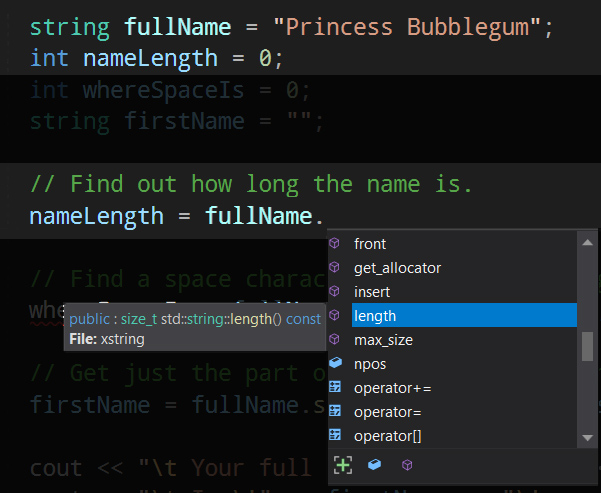

## Week9 Homework

I left you guys a challenge: [Listen for input](../week9/#go-deeper-listen-for-input)

## Using Objects
 
 Objects are a types of data in C++ that have more complexity than your basic types (int, float, char).
 
 ### Objects can
  
  * Behave like a normal variable. `string` is an example.
    ```cpp
    string fullName = "Princess Bubblegum";
    ```
  * Also behave like folders that contain more variables and functions inside
    * We can access them by putting a dot `.` right after the variable name


The `string` object has plenty of useful functions.



You access variables and functions within an object by typing its  <b>variable name followed by a dot</b>. Intellisense will offer you a **list** of functions/variables for that data type. 

Here, it's `string`, and I've found a `length()` function:




#### Dive Deeper: String Functions

* `string::substr()` (substring) [documentation](http://www.cplusplus.com/reference/string/string/substr/) 
* `string::length()` [documentation](http://www.cplusplus.com/reference/string/string/length/)
* `string` object [documentation](http://www.cplusplus.com/reference/string/string/)
    
Objects:
  * Exist in the C++ libraries: `string`, `cout` 
  * Are things we can create to suit our own programs.
  * Can be made to represent anything you need
  * Are an abstraction: we put the complexity of variables and functions inside our object, and just use it as if it was a real thing. 
      ```cpp
      myLaserGun.charge = 100000;
      myLaserGun.pew();
      myLaserGun.pew();
      ```

### Objects Organise Things

Storing a character in your program as a couple separate variables might be fine, but what if you have two, or five? 15, 20, 25 variables? name1, height1, xPosition1, yPosition1, name2, height2... 

Have objects **lump things together**.
<!--
```cpp
Hero player1;     // Both players 
Hero player2;     // So have same named variables available.

// Set up player1 data
player1.name = "Jada Pinkett Smith";
player1.heroCategory = ACTRESS;
player1.height = "151";

// Set up player 2 data
player2.name = "Deng Xiaoping";
player2.heroCategory = POLITICIAN;
player2.height = "152";
```
-->
### Objects Match Our Thinking

Humans live in a world of objects with properties that do things.
We're sitting on **chairs**.
* At a minimum they have a `seatHeight`
* Maybe it `hasWheels` (t/f), maybe it doesn't.
* If your chair `hasGasLift` (t/f), then you can `adjustHeightGas(UP, 2)`, or `adjustHeightGas(DOWN, 1)`

**In C++**, that would look like:

Declaring a variable of type `Chair` and using its variables with <em>dot notation</em>.


The **output**:
```
Danny's chair seat is 48cms above ground.
Danny's seat height was adjusted to 42cm above ground.
```


## Moving

### Up Down Left Right




So, we can move left and right by changing our x location.

### Exercise: Control Movement
// code to move left and right, type it in

## Too fast!

Right now our loop runs 60 times per second. If we move one pixel every loop thats 60 pixels a second, and our window is only 30!

maths: 
60 loops * move 1 pixel in x = we moved right 60 pixels 1 second.  
30 pixels in window / 60 moved per second = 0.5 seconds!

How do we change the speed? 

### Don't move so far each frame

But we're moving 1 pixel, we'd have to move **move less than 1 pixel** per loop but.. fractions! That gets complicated: you have to use floats, and round to the nearest pixel etc.
    DIAGRAM
    
### Easy Fix, Change The Framerate! 

If the problem is that the game is running too fast, just run it slower!

#### Exercise: setFPS

textpixels has a handy function to do it. Put it **inside main, before the game loop**
```cpp
  textpixel::setFPS(60);
```

Figure out the fps needed to cross the window (30 pixels) in 2 seconds. Apply it in the code. Looks good!

### Looks Good Feels Bad: Responsiveness

_textpixel_ locks the framerate by **sleeping** until you need it to draw another frame. The problem is: it's **so fast** at its job, it only takes about **0.001 of a second to draw a frame**. Since it sleeps the rest of the time, your game **misses keyboard inputs** because it's **barely ever running**.


It takes 1/1000th (0.001) of a second to do a frame's work. It sleeps the rest.

**15 fps * 0.001 = 0.015** seconds of work per second: **it's awake 1.5%** of the time.

So _textpixels_ is sleeping 98.5% of every second, in gaps of about 65ms.


If our game isn't running most of the time, and sleeps in 65ms blocks, **it's easy for textpixels to miss keypresses**.

    DIAGRAM

