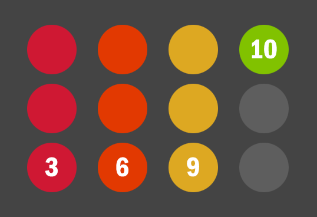

<!-- First, what are functions and how do you use them? -->
## Doing the same thing, but different

In a **shooter** like _Battlefield_, _Overwatch_ or _Fortnight_, what are you doing a lot of? **Shooting**. Hitting things, missing things. Weapon switching, reloading. 

In a **platformer like _Super Mario Bros_** you do a lot of **jumping** and **colliding with things**. You **collect** who-knows-how-many items (coins, stars, mushrooms), and sometimes you **power up**.


Platforming actions



A game, boiled down, is **a person performing a small set of actions, many times.** Actions which
* Have predictable properties (a jump goes this high, and higher if I hold the button)
* Occur in many different scenarios (off a platform, under a brick, onto an enemy)
* Produce outcomes appropriate (following the game rules and world physics) to their current scenario.


**You as a programmer** then, have to do the **same thing** a lot, but that same thing has to react **dynamically** to different inputs/environments.

### Way too many `if`s

Picture our little game loop in main: if we have to react dynamically to whatever button is pressed, under any circumstances, we're going to need **a loooot of conditionals**!

> If she presses jump, if _running_, if not riding yoshi, if has a mushroom power up, **do this**.
> If she presses jump, if _walking_, if not riding yoshi, if has a mushroom power up, **do this**.
> etc etc.

It'll mean a lot of **repetition** too.


If you're able to draw big, long shapes like this beside your code, life gets hard.


## Reusable code: Functions

Functions are like little programs within your program, and they're written once to do a small, focussed job. 

You then call on them whenever you need that thing, say starting a jump, checking for a hit, calculating damage.

To use them:
1) Evoke them by name 
2) Give them some input (if they need it)
3) They do some things
4) They feed you back (usually) some output.

### Free functions!

> Writing functions save you a lot of work. Using someone else's functions though, that's even better!

Places we get free functions:
* Packaged with _C++_, in the _**Standard Library**_


Cplusplus.com reference for the <code>ceil()</code> function


* Our **work colleagues**, friends or teams we're making games with, Github, game engines, operating systems, drivers and many, many more.

### The Standard Library

The keywords of the language give you the basic building blocks to make whatever you need.  That leaves out a lot of everyday things you might need though like:
* reading files
* generating random numbers
* rounding off numbers
* trigonometry and much more.

The Standard Library functions are spread out in a number of library files, but all use the same `std` prefix.
1: **include** the right **header** like `#include <cmath>`
2: Either use `std::` or `using namespace std` to access the function. Now you know what that really means.

> To find which header holds the function, google like so: for absolute values (turn a negative positive) google "absolute value C++" and click [abs - C++ Reference - Cplusplus.com](http://www.cplusplus.com/reference/cmath/abs/).

### Handy Math For Games

Here's Some very basic but very necessary math you don't want to have to code yourself.

| Function  | Header      | Description                                                   | Returns            | Link |
|-----------|-------------|---------------------------------------------------------------|-----------------|------|
| **abs**   | cmath     | Takes a number, returns the **positive value**  (-2 becomes 2)  | int, float etc     | [docs](http://www.cplusplus.com/reference/cmath/abs/)     |
| **ceil**  | cmath     | Takes a decimal, returns **nearest higher** whole number        | float, double      | [docs](http://www.cplusplus.com/reference/cmath/ceil/)    |
| **lround**| cmath     | Takes a decimal, returns **rounded** result, converted to int.  | int (use round for float) | [docs](http://www.cplusplus.com/reference/cmath/round/)    |
| **pow**   | cmath     | Takes numbers a and b, returns **a to the power of b**          | double      | [docs](http://www.cplusplus.com/reference/cmath/ceil/)    |
| **srand** | cstdlib   | Takes a number, **seeds** random number generator               | void                | [docs](http://www.cplusplus.com/reference/cstdlib/srand/) |
| **rand**  | cstdlib   | Generates a **random number** from 0 to RAND_MAX                | unsigned int        | [docs](http://www.cplusplus.com/reference/cstdlib/rand/)  |
| **time**  | ctime     | **Time** in seconds since Jan 1 1970. Good seed for srand.      | time_t              | [docs](http://www.cplusplus.com/reference/ctime/time/)    |

### Calling a function

You _call_ a function by writing its name followed by parentheses.

```cpp  
// Just focus on the part after `=`
int rand1 = rand();
```

### Passing data to a function

You _pass_ it input data, called _arguments_ or _parameters_ by putting variables or literals in the parentheses.

If you're asking someone to do a real world job for you, say get you something while they're on holiday, they need data! What is it, where can they find it, how much will it cost?

```cpp
/// print out the result of flooring (rounding down) the decimal `5.7`
cout << floor(5.7f);

/// Using `pow` to get the square of a number.
/// You can pass any data (variables, literals etc) to functions.
int x = 5;
int xSquared = pow(x, 2);
cout << xSquared;
```

**Output:**
>  5  
>  25  

### Do something with the return values!

A function (often) _returns_ a result, which has a data type (int, float) etc. In the code above, `pow(x,2)` is processed and returned `25`. This is just like a maths expression, say `5*2`, is processed into a result, `10`. It is only held in memory temporarily, and if not stored will be lost when you move on.

You want to do something useful with the return values like you would with the result of any expression:
* Store it in a variable or
* Print it to the console with `cout` or
* Use the result in another expression

```cpp
/// You wouldn't write this without printing or storing the result
5 * 2;      
/// ( The result, 10, evaporates.. )

/// So don't expect anything useful to happen if you do this:
roundl(3.6f);
/// ( The result, 3.0f, evaporates.. )

// Try storing the result
int nearestWhole = roundl(3.6f);    // Stores 3

// Printing the result
cout << "Nearest whole number to 3.6 is " << round(3.6f);

// Using the result in an expression, then storing the result of the expression.
// I'm using use the results in a simple calculation, averaging two numbers:
// Average of two numbers = (a + b) / 2
float roundedNumbersAverage = (roundl(3.6f) + roundl(1.2f)) / 2.0f;

```

## Functions for random numbers

C++, like most languages, offers functions that **generate random numbers** for you.

The most basic of them is `rand()`. Have a look at this definition of `rand()` from [cplusplus.com](http://www.cplusplus.com/reference/cstdlib/rand/).


Click for more info.


## Exercise: Random code

[Type out and run the code below on JDoodle.com.](https://www.jdoodle.com/online-compiler-c++17/)

Printing the random number and the range of numbers possible.

Now, edit the code to create and print 3 random numbers. 

> Hints: Keep it simple, don't use a loop for now. Another `int` called `rand2` might help. 

### Not that random.

You might have noticed by now that your random numbers, though pretty random are **always the same** 3 randoms.

> "That's not very random." - everyone.


Before starting his rounds in the hospital cardiac ward, Nurse Feng has to calculate the dosage of heart medication for one of his patients. He enters `high blood pressure`, `female` and `66kg`. The machine outputs:
> Verapamil, 5mg. (high bp, female, 60-70kg)
Just to be safe, he runs it again
> Verapamil, 26mg. (high bp, female, 60-70kg)

Clearly, computers that gave different results each time you run the same calculation would be **very very bad**. 

This is why computers are designed to be _deterministic systems_: if you start at the same point, with the same data, and take the same steps, you can expect the same outcome.


### Psuedo-randomness

Computers, then, are actually bad at being random, because everything about their design had one main goal: stopping anything random happening! 

This is one reason we call `rand()` a **pseudo-random number generator**. It can generate a long series of seemingly random numbers, but it has to start somewhere and it always does that the same way.

### Seeding

We can **change the starting point** of the random calculation.

A **_seed_** is a number we feed to the computer something it doesn't control. 

We can start with something pulled from thin air, like `10`.
* `rand()` doesn't just accept a seed argument 😢
* Instead we can pass 10 to `srand()`.  


New seed, new result?


Try adding it to your 3 number generator, like i've done below for rand1. You only need to call it once.

### New problems 

Run it a few times. What's wrong?? 

Now we have the respsibility of feeding `srand()` a different value whenever we start our program. It sounds like we've circled back to the same problem.. but **the number we feed in doesn't have to be random, just different each time**. 

* We'll use a very basic one: the current time (to the second).


Click to expand


<!-- end learning how to just USE functions -->

A section of a computer program that is **defined only once** but can be **called on when needed**. 

Though we'll (mostly) call them functions, they have several names across programming languages. Even within _C++_ you'll hear more than one. 

The most common are:
* method
* procedure
* routine
* subroutine
* subprogram
  
Are there any **you know** that aren't listed here?


## Making your own functions

You can define them to handle whatever job you need done, then call them whenever needed. You can hand them new data to work on each time, and grab their results to use or pass to other functions to get even more done.

They're easy to create because they have the same basic components as their parent programs: input, storage, processing and output.

The function `twoTimes` takes a number and multiplies it by 2:

### Declaring a function

**Just like a variable**, a function needs to be _declared_. We have to tell _C++_ what it's **named**, what input it **accepts**, and what type of data it's going to **return**.
* Like a variable, you write the _type_ followed by the _name_
* Unlike a variable, you put **parentheses on the end** to tell C++ it's a function.

```cpp
// Declaring a function that returns my age as an int 
int myAge();
```

If your function will accept inputs, you declare those in the parentheses

```cpp
// Declaring a function that multiply any (integer) input value by two and return the (integer) result.
int twoTimes ( int inputValue );
```

### Defining the function body

Just like a variable without a value isn't much use, a function without any code isn't much use.

To make it useful, you have to _define_ the function body in curly braces `{}`. Just like code blocks for `if`, `for` and `while`, it can hold new variables (storage) and statements (processing).

Here we'll **declare and define** twoTimes:

[](function_twoTimes_code.png)

The **output** or result of a function is called the **return value**. That's what will take the place of the function call when it has been processed

[call twoDozen](call_twoDozen_code.png)

### Exercise: Creating the twoTimes program.

Using this guide below and the code above, create the twoTimes program in Visual Studio.

```cpp
#include <_____>  // What do we need for cout?
```

The program should produce this output:

[twoDozen output](twoDozen_output.png)


## Back to randoms: Ranges

`RAND_MAX` is already set in the _Standard Library_. To adjust the result of `rand()` to a **custom range** we have to use maths. One easy way: use the **remainder** of whole integer division.


**Dividing** one whole number by another gives us two results: the _**quotient**_ and _**remainder**_. 

_C++_ gives us the _quotient_ with the division operator `/`, and the _remainder_ with the modulus operator, `%`. Look at **10 divided by 3:**

  

There are **3** (quotient) sets of 3 balls. **1** (remainder) is left over.

**In _C++_:**
```cpp
int quotient = 10 / 3;  // quotient == 3
int remainder = 10 % 3;    // remainder == 1
```


#### Remainder as range

The remainder of any number over 3 can only be 0, 1, or 2. This picture will help:


There are <b>3</b> (quotient) sets of 3 balls. <b>2</b> (remainder) are left over.


We've had remainder 1, 2.. if we add another ball we'll have remainder 0. The rule then is:

```cpp
////  0, 1, 2 
number0To2 = number % (3);

//// 0,1,2,3
number0To3 = number % (4);

//// A pattern emerges..
number0ToRange = number % (range + 1);

```

## Summary

This week we learned:
* Functions are like mini programs: 
  * input, storage, processing, output
* Creating and calling functions
* How functions make programming easier
* Ways to get more out of functions
  * Passing arguments
  * Descriptive function names
  * Returning values.

## Homework

**This homework is part of the assessment** and its completion will contribute to your overall mark.

### Reading

Read [Chapter 5](../resources/cpp_through_games_5.pdf), pages blah to blah. Functions will be your bread and butter from now on, so get your head around them!


You can **declare a function before main()** and **define the body after**. Be ready to see this in the textbook.



<b>Click to download</b> Chapter 5.



### Random function

Upgrading _Randoms\_introduction_ with functions. I've written the structure, it's up to you to replace the missing code. The lines (__, _____) don't always match the length of the answer.

<!--

Click to expand.

-->
### Calculatemore

Two times calculator is a bit limited. The user has no control over the two numbers being multiplied.

Add the following features:
* Ask the player to input a multiplier (int) and store it.
* Now, ask them for a multiplicand (int) and store it
* Calculate the product by calling a "multiply" function which takes the two numbers as _arguments_ and returns an _int_. Store that value.
* Print the product.

The terminology of multiplication (from [wikipedia](https://en.wikipedia.org/wiki/Multiplication))
> **multiplier** * **multiplicand** = **product**
  

