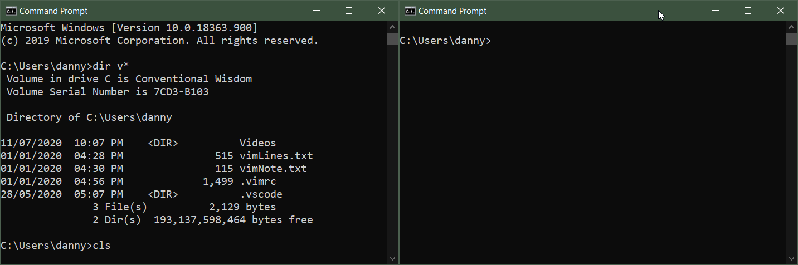

## Week 6 Homework Review

* How did I do week 6's homework?
* Why did I do it that way?

Demo.

## Exercise 1: Enter the code

If you typed along with me or got your code to where we're basically at the same point, have a break.

If you didn't follow along with me or didn't keep up, type in the code below/add fixes to your homework and then we'll move on to clearing the screen.

## Exercise: Refreshing the console

Our game is scrolling off down the screen like a chatroom. It's not a natural fit for our game, with its distinct screens.


`system("cls");` wipes the console clear and puts the cursor top left. 

Basically we're using the `system()` function to run a command (`"cls"`) in the console by passing it as an argument.


Here's what happens if you type <i>cls &#8629;</i>  in a regular windows command prompt. Don't worry, in c++ we won't see the `c:\Users\username` prompt.


### Add screen clear to Slots

> Adding `system("cls")` between screens.

`main()`, the boss, controls what's showing next on screen by calling functions. 
- functions don't know what happens before or after they're done. They just output stuff and pause.
- This makes it `main()`'s job to trigger the clear.

demo: adding clear.

### A bug appears

> Our game returns to the main menu at random points? Why?

It was always going back to main after drawing screens, but it wasn't wiping everything else away when it did.

We need to **wait before clearing the screen**.
We could wait for:
* Time: Waiting for x seconds might work, but what about slow readers? Or fast readers.
* Player Input: RPGs have lots of text to read, and you mash a button to move on. That's a better fit.


`_getch` waits for any keypress. Requires `#include <conio.h>`.


<!--
## Debugging: What's WRONG With This Code?


Hello, Mr Smith.


We have total control over the **_writing_** of our code. We can plan it, craft it carefully, line by line. We can tidy things into neat little packages, functions that promise to take what we have and give us what we need. We **mentally step over it**, imagining a user typing in responses, and see that.. yes, this will work very well, if I haven't missed something.

**Then.. you compile and run it.** It transforms in to a mysterious, shadowy thing living deep in the silicon brain of your computer. It's now binary 1s and 0s, expressed as real electrons slamming through copper at half the speed of light. 

And **yes, you have missed something.**

### Now What?!

We do what anyone does to fix a machine or process: calmly slice it down into some basic, manageable categories, then check them.

### Sources Of Bugs

First up, **you** are the source of 99% of bugs. Very occasionaly there's something wrong with a library or documentation. 

### Syntax Errors

These are the ones that stop you compiling, and are mostly pretty easy to fix. 
* Visual Studio tells you the kind of error along with the line it's on
* If you don't know the error, you Google it and usually
  * it's in the cpp reference or
  * someone on stackoverflow (or other forum) has solved it before.


A Syntax Error is a problem in the structure of your code that confuses the compiler and prevents it compiling. It can often be a single character out of place missing. 
Examples:
* missing or extra semicolon `;`
* swapping upperCase and lowerCase `animalCrackers` becomes `Animalcrackers`
* a forgotten parenthesis `)` or curly brace `}`
* accidentally escaping quotes so a string continues forever `\"`
* many, many others


### Logic Errors

These are the ones where your **program compiles, but doesn't do what you expected**. Also known as _semantic_ errors.

To get to the bottom of these, "what was my mistake?" is the question to answer. As always, things get easier when we group things into categories. Once you get used to **the kinds of mistakes you can make**, finding bugs  is easier.

#### The Design Error


Chef Gomez, a huge celebrity chef, produces a book of dessert recipes. She becomes a meme on Instagram when every one who tries to cook his chocolate cake turn out giant chocolate cookies.
The recipe, it turns out, is a perfectly good one. Chef Gomez, on the other hand, apparently took a knock to the head and is convinced a cake is a large crunchy treat. 

**The problem is the design, not the way it was encoded as a recipe.**




So you've **designed a solution** and then written code that **successfully implements** it. The steps you described, however, **wouldn't actually complete the given task**.

* eg: A program to find the volume of a cylinder: it's perfectly implemented in code.. but you were on the wrong wikipedia page and used the formula for a cone.
* eg: The character jumps and falls through the floor: it's coded right, but the math you chose for checking when a character hits a platform is faulty because you aren't great at geometry.

#### The Language Usage Error

* Solution was good but code implementation doesnt actually match your planned solution
* Spring from misunderstanding language
* Eg: you write a test for three of a kind and it’s well designed in psuedocode: but you misunderstand how to join up the tests (chaining `==` instead of using a combination of `==` and `&&`). It triggers for 3 of a kind  but also pairs.
* EG: the maths are right but answer us wrong. Maybe You aren’t accounting for the precision of floating points. Or you are adding integers and the result is larger than the variable can hold.

```cpp
#include <iostream>
using namespace std;

int main()
{
  int a = 0;
  int b = 0;
  int c = 0;

  if ( a == b == c )
  {
    cout << "\t Equal! \n";
  }
  else
  {
    cout << "\t Not equal :( \n";
  }
}
```
#### The Library Usage Error
* Passing the wrong scale of value in (milliseconds instead of seconds)
* Thinking a return value implies success, when it actually means error.

#### The Brain Fart

Don't foget the good old brain fart. They can be any of the above errors that happen despite your knowledge and experience because you're tired, distracted, hurrying etc. Especially common when you've been coding too long without a break, or don't eat and sleep enough.

* Assigning to the wrong variable
* Calling a function and forgetting to assign the result
* Switching your true/false logic
* Understanding operators but still just typing the wrong one (`>` instead of `>=` etc)
* Putting a return inside a loop instead of after it.

#### Others

Thoughts?

## Debugging By Output

### User Testing

Imagine you're the end user of a product. You can't change the code in any way. You can only test by:

1: Trying different inputs
2: Observing the output. 

In some cases, if you test enough inputs and notice a pattern in the outputs, you might just figure out what's happening.
-->
<!--
### Adding Debug Output

Relying on the program's existing outputs is quite limiting, and we have to infer what's happening. We have a degree of freedom the user doesn't have.. we can make the computer output what it knows at any point. 


Encourage your program to tell you things.


This is called `debug output`, and like a 1g1un in Samuel L Jackson's hand, it makes the program more _verbose_.


#### Example

Say we were calling `spinWheels()` in our slot machine to 1. generate 3 numbers and 2. check for a win. If the winnings were wrong for a given bet we might need to see variable values at certain times. We can do that with lots of cout statements. The word "DEBUG:" is just for readability.


Couts inserted: Click to zoom.



Debug output while testing the game: Click to zoom



pros: 
* you can make lots of new information available: 
  * the state of your variables
  * the count reached by your loops 
  * whether the body of an if statement is ever reached, etc.
cons: 
* You have to add all the ouput manually.
* Since you're putting output where you think the bug might be, you're probably only finding the bugs you expect to find.

## Rubber Ducking

You've stepped through your code 20 times and can't see a problem. You ask someone for help, and as you start to explain your problem the realisation dawns: you've looked directly at the error 20 times and know exactly where it is. You've wasted their time.


There's nowhere to hide.


After a while a pattern emerges. Just the **attempt to explain the bug** helped you see it from a fresh perspective. You didn't need to invite anyone over, **you could have explained it to a rubber duck* and achieved the same outcome.


We're listening.


## Digital God: The Debugger

The _debugger_ is on a whole other level. It lets you see inside your program, to slow it down to human speeds, stopping and starting it at your command.


Be like Neo. See the matrix, control the matrix.


It can:
* See the programs variables, their types and their contents
* Stop and start execution, line by line
* See what literals like `0.06` and `b` are being treated as (`double` and `char`)
* Critically, you can follow the execution path and see if areas of your program (inside functions, loops, ifs) are ever reached.


No cout required: the <i>debugger</i> halting and looking inside the program in real time


### What Is The Debugger

It's a few things: 
* Mainly, it's another program that loads and sits in memory. 
  * It has special permission to access and change the memory given over to your program.
* It's the interface mode of Visual Studio that lets you interact with the debugger program
* It's also extra stuff compiled into your slots game that makes it possible.

### Exercise: Breakpoints And Step Through

* Step through simple program.
* Watch locals changed
* Watch an if statement


## More Slots


Slots 3 with real bets and fake spin. Click to expand.



Slots 3 after key press to return. Click to expand.


The game now:
1. Has `spinwWheels()` function that (claims to) generate numbers and returns an `outcome`.
1. Takes real bets and checking they're valid.
1. Uses the player's `bet`
1. Uses `outcome` and `bet` to calculate `winnings` (in `playSlots` function)
1. Has an `enum` containing multipliers for each win type.
1. Waits for keypress after a game, then clears screen and returns to menu.

### Simple View: See The Pieces First


Reading these function signatures and the comment above each should tell you enough to understand what's going on.


### The Functions


Each function alone reads like a pretty simple program. Manageable chunks that you can write!



### New Tricks

* `_getch` waits for any keypress. Requires `#include <conio.h>`.
* `system("cls");` clears the console. It calls `cls`, a command in the windows console.
* A `do.. while()` loop in the flesh.

-->

## Coding Conventions

Agreeing on a style of code formatting and capitalisation.

In my old week 6 notes:
[https://dmcgits.github.io/mds/ISE102/week6_notes.html](https://dmcgits.github.io/mds/ISE102/week6_notes.html)


