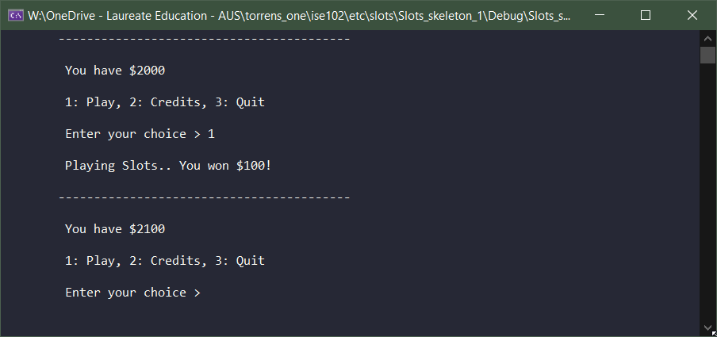
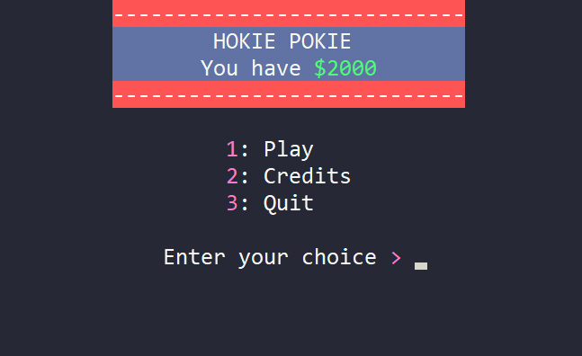

## Slots Is Done

* Thanks for submissions
* Check Blackboard. Some people submitted the wrong files and I've messaged you about resubmitting. Each day costs marks so act now.
* I haven't looked at the code yet, just that the file structure looked right.

## Beyond Text Entry Mode

We've been making games in an environment like a chat, or a left-justified text document. 

### Input and Storage

* We can listen for input from a keyboard
* People can type in characters, digits, sentences
* Once they hit enter, we can store that data

### Drawing 

* We have symbols!
* We can space stuff out.. from the top or left.


* We have colours!


### Limitations

Two big elements stand out as missing from our console/terminal games.

#### 1. Drawing Anwywhere

We're really limited in **where we can place things** on screen. 

**Text symbols are** actually **not bad** for drawing graphics
- you can represent a lot with colour and symbols. 
- Buuut **we have to stack them** up from the left of the screen, line by line
- We can't change things we've drawn, except to clear the screen try again.

When you look at htop (like windows task manager) running in a console, it becomes obvious that the command prompt is just a grid of characters.


Rows and columns become obvious


If you could draw to each one **directly with x,y coordinates** you could do stuff like this:


Games on early consoles like the Fairchild Channel F are close to text mode but would be painful to make and play with our current method.



Low colour and a larger character set can be made to do a lot



How programs looked in text terminal days



Textmode 2000



ZZT



We could make something like this more easily.


## Solution: TextPixels

I'll give you a Visual Studio solution today with a library that draws coloured unicode text characters anywhere in the console. 

* It is effectively like changing big pixels on a low resolution screen
* It can move to and draw at any x,y coordinate in any sequence
    * no left to right, no tabs `\t` or spaces or newlines `\n` needed.
* If you picture the command prompt completely full of text, like a find a word puzzle, those are our text pixels.


Some of the drawing routines in TextPixels demonstrated


### Drawing To Screen Coordinates

As you know, a computer screen is a big grid of pixels. Every time that grid is updated, that's one frame of your game, or 1 hz (hertz).

Before LCDs computer monitors were, like televisions, cathode ray tubes. The shot a beam of electrons at the pixels to change their colour, and they only had one beam, so they had to sweep the screen pixel by pixel.


As you can see, the beam swept from top left to top right, and continued down the screen row by row.


When you draw to a screen in code we use the same coordinates, and textpixel uses this system as well.


A tiny arduino screen



Pixels at x,y coordinates



Drawing a filled rectangle on a screen


### Character Set

Our projects so far have been limited to the basic 128 character set, which doesn't get you much more than what is on your keyboard. **TextPixels uses unicode,** which gives us handy stuff like the "box drawing" characters and pixels with different fills:


Click for the Wikipeda page


We'll get into how to use more of those later, but to get started we'll have **access to the solid pixel** with `drawPixel(x,y)`

### Download The Example

[Console_Drawing_Week_9.zip](Console_Drawing_Week_9.zip) (Updated with `fillRect(x, y, width, height)` and `fillRectByCoords(x, y, x2, y2)` working correctly)

We'll treat the characters on screen as giant pixels. Using the TextPixels library, they'll be made square.

**Load and run** the code. Examine the code provided for:

 * drawing a pixel
 * drawing a string
 * Numbers to a string
 * filling a row with a character
 * Show fps


The output


Here's a look at `draw()`, which calls a bunch of textpixels functions:

```cpp {.line-numbers}

void draw()
{
  //// WindowWidth and WindowHeight are both 30 by default.
  //// Draw a rectangle that fills the screen with colour to clear it
  //// From 0,0, and 30 total pixels wide and high.
  fillRect(0, 0, windowWidth(), windowHeight(), FG_DARK_MAGENTA);
  
  //// Here I do exactly the same thing with fillRectByCoords
  //// I draw from 0,0 to 29,29 because 0-29 is thirty (look at top border)
  fillRectByCoords(0, 0, windowWidth()-1, windowHeight()-1, FG_DARK_MAGENTA);

  //// Draw a rectangle 2 pixels shorter and narrower, starting at 1,1.
  //// That leaves us a 1 pixel border on all sides
  fillRect(1, 1, windowWidth()-2, windowHeight()-2, FG_GREY);
  
  //// Draw a single pixel mid screen
  drawPixel(windowWidth() / 2, windowHeight() / 2, FG_GREEN);
  
  //// Print the frames per second on the bottom visible row of the screen.
  drawString(1, windowHeight() - 1, "FPS: " + getFpsString(), layerColours(FG_GREY, BG_DARK_MAGENTA));
  
  //// Draw column numbers along the top row, leaving off the 1 in numbers > 9
  for (int column = 0; column < windowWidth(); column++) {
    drawWString(column, 0, to_wstring(column % 10), layerColours(FG_GREY, BG_DARK_MAGENTA));
  }
  //// draw = all along a row, but not on the borders.
  for (int column = 1; column < windowWidth()-1; column++) {
      drawWCharacter(column, 20, L'=', layerColours(FG_DARK_BLUE, BG_GREY));
  }
  return;

}

```

## Exercise

Read the code and comments carefully. Hover over function names for an explanation of what they do.

1. Change the symbol that is drawn across a row to something else.
2. Make it go from top to bottom (y) instead of across (x).
3. Change the foreground and background colour of the symbol.
4. Change the border colour.

### How did we do?

Good? Do more!

5. Draw a 10 pixel square at the bottom right of the window, but don't draw over the border.
   - Use either `fillRect` or `fillRectByCoords`, whichever makes the most sense to you
6. Draw 3 pixels at random places in 3 different colours using `drawPixel`.
7. Draw a Tetris L piece somewhere the screen. Falling at whatever orientation you like. 

The Tetris L piece.

8. Using loops, fill the screen with horizontal stripes, using one colour for even lines and another for odd lines. 
    * Any two colours will do.
    * Hint: modulus (the remainder of integer division) is good at telling odd from even.

## Go Deeper: Listen for input 

We asked our programmer to make a program that fills the screen with red when the _R_ key is pressed, and yellow when _Y_ is pressed. If we don't have it up and running within 7 days we'll definitely go out of business.

Our best programmer was on the task, but she hasn't yet returned from her Genetically Engineered Dinosaur Rescue Park holiday. The  working files are here, and she noted how to finish it in her comments. Can you finish it?

It's above our heads: all we know is the function `keyIsDown('R')` returns `true` if the _R_ key is being held down. 

Download [Week9_TapColours.zip](Week9_TapColours.zip) if you're programmer enough to do it.

### In Sorta Pseudocode

```
Listen for R  or Y
If it's R:
  fill screen with red
If it's Y: 
  fill with yellow  
```


<!--
## New Game Loop

We've been waiting for input and reacting. Most modern games don't work that way.

### FPS

30, 60, 144 frames per second? How long is your output on screen before it's redrawn again? There are **1000 milliseconds in a second**. 1000 / fps gives us the **time on screen**.

| FPS                        | Time (ms) per frame               |
|--------                    |-----------------------------------|
| **30** (console)           | 1000/30  = **33.3ms**             | 
| **60** (most monitors)     | 1000/60  = **16.6ms**             | 
| **144** (gaming monitor)   | 1000/144 = **6.9ms**              | 

### Our Old Game Loop

Here's the game loop we know so far, in pseudocode:

```
while (player hasn't quit)
  Display a prompt (output), asking player for input
  Wait for input.......
  process input.
  Display results of processing
end while

show quit message
```

### Animated Game Loop

We can't just leave output on the screen for as long as the player takes to react. Things have to move! At 60fps!

A new game loop:

```
while (player hasn't quit)
  check for input
  update state of all things in game
  draw graphics to screen
end while
```

### Pixels

A grid. 

Starts top left, ends bottom right. Need a graphic.

5 cells by 5 cells:

0 1 2 3 4  
1 1 2 3 4  
2 2 2 3 4  
3 3 3 3 4  
4 4 4 4 4  

Notice something very important: it starts at 0! Drawing last cell of screen is 4,4.
-->